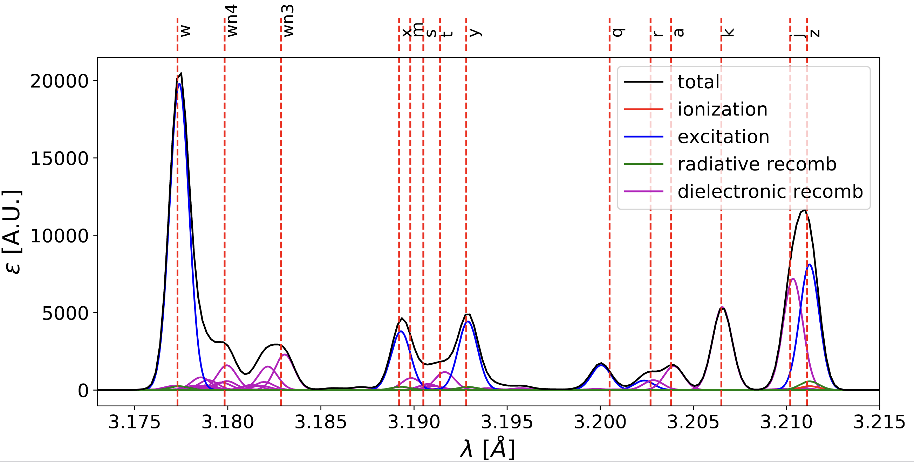

Atomic data
===========

Almost all of the Aurora functionality depends on having access to Atomic Data and Analysis Structure (ADAS) rates. These are needed to determine effective ionization and recombination rates for all charge states, estimate radiated power, soft X-ray contributions, charge exchange components, etc..

Everything that is needed can be obtained from the OPEN-ADAS website:

  https://open.adas.ac.uk/

Aurora attempts to make atomic data usage as simple as possible. The :py:func:`~aurora.adas_files.adas_files_dict` function gives a dictionary of recommended files that users can adopt (but also easily override, if other files are preferable). See the :py:func:`~aurora.atomic.get_file_types` function docstring for a brief description of each relevant file type.

The `adas_data` directory at the base of the Aurora distribution is where ADAS atomic data should be stored, separately for ADF11 (iso-nuclear master files) and ADF15 (photon emissivity coefficients). When running Aurora, the :py:func:`~aurora.adas_files.get_adas_file_loc` function automatically checks whether the requested ADF11 file is available in `adas_data/adf11/` or in a directory that users may specify by setting an environmental variable `AURORA_ADAS_DIR`. If the requested file is not available here either, Aurora attempts to fetch it automatically from the OPEN-ADAS website. Each ADF11 file is stored in `adas_data` after usage, so downloading over the internet is only done if no other option is available.

Atomic data is also used for radiation predictions, both via ADAS ADF11 files (iso-nuclear master files, giving effective coefficients for combined atomic processes) and via ADF15 files (photon emissivity coefficients - PECs - for specific atomic lines):

(a) A number of functions are available in the :py:mod:`~aurora.radiation` module to plot effective radiation terms, e.g. total line radiation for an ion, main ion bremsstrahlung, etc.

(b) The :py:func:`~aurora.radiation.read_adf15` function allows reading and plotting of ADF15, making it easy to evaluate PECs for specific densities and temperatures by using the returned interpolation functions. PEC components due to excitation, recombination and charge exchange can all be easily loaded and plotted. However, Aurora users may also make use of the coupling to `ColRadPy`_ to produce PECs using ADAS ADF04 files and running ColRadPy's collisional-radiative model. This functionality is already available in the :py:func:`~aurora.radiation.get_colradpy_pec_prof` function and will be further developed in the future.

.. _ColRadPy: https://github.com/johnson-c/ColRadPy

See the tutorial in :ref:`Radiation predictions` for more information on these subjects.

Atomic spectra
--------------

If you have atomic data files containing photon emissivity coefficients (PECs) in ADF15 format, you can use Aurora to combine them and see what the overall spectrum might look like. Let's say you want to look at the :math:`K_\alpha` spectrum of Ca at a specific electron density of :math:`10^{14}` :math:`cm^{-3}` and temperature of 1 keV. Let's begin with a single ADF15 file located at the following path::

  filepath_he='~/pec#ca18.dat'

The simplest way to check what the spectrum may look like is to weigh contributions from different charge states according to their fractional abundances at ionization equilibrium. Aurora allows you to get the fractional abundances with just a couple of lines::

  ion = 'Ca'
  ne_cm3 = 1e14
  Te_eV = 1e3
  atom_data = aurora.get_atom_data(ion,['scd','acd'])
  Te, fz = aurora.get_frac_abundances(atom_data, np.array([ne_cm3,]), np.array([Te_eV,]), plot=False)

You can now use the `aurora.get_local_spectrum` function to read all the lines in each ADF15 file and broaden them according to some ion temperature (which could be dictated by broadening mechanisms other than Doppler effects, in principle). For our example, one can do::

  # He-like state
  out= aurora.get_local_spectrum(filepath_he, ion, ne_cm3, Te_eV, n0_cm3=0.0,
                               ion_exc_rec_dens=[fz[0,-4], fz[0,-3], fz[0,-2]], # Li-like, He-like, H-like
                               dlam_A = 0.0, plot_spec_tot=False, no_leg=True,
			       plot_all_lines=True, ax=None)
  wave_final_he, spec_ion_he, spec_exc_he, spec_rec_he, spec_dr_he, spec_cx_he, ax = out

By changing the `dlam_A` parameter, you can also add a wavelength shift (e.g. from the Doppler effect). The `ion_exc_rec_dens` parameter allows specification of fractional abundances for the charge stages of interest. To be quite general, in the lines above we have included contributions to the spectrum from ionizing, excited and recombining PEC components. By passing an `ax` argument one can also specify which matplotlib axes are used for plotting.

By repeating the same operations using several ADF15 files, one can overplot contributions to the spectrum from several charge states. As an example, the figure below shows the K-alpha spectrum of Ca, with contributions from Li-like, He-like and H-like Ca, evaluated at 1 keV and :math:`10^{20}` :math:`cm^{-3}`.

    Example of high-resolution K-alpha spectrum of Ca

If you just want to plot where atomic lines are expected to be and how intense their PECs are at specific plasma conditions, you can also use the simpler `aurora.adf15_line_identification` function. This can be called as::

  aurora.adf15_line_identification(pec_files, Te_eV=Te_eV, ne_cm3=ne_cm3, mult=mult)

and can be used to plot something like this:

.. figure:: figs/spectrum_adf15_identification.jpg
    :align: center
    :alt: example of Ca spectrum overview combining several PEC files
    :figclass: align-center

    Example of Ca spectrum overview combining several PEC files

A&M data from AMJUEL/HYDHEL
-------------------------------

Aurora allows one to load and process atomic and molecular (A&M) rates collected in the form of polynomial fits in the AMJUEL and HYDHEL databases, publicly released as part of the EIRENE code. These rates are partly redundant and partly complement those provided by ADAS.

The following code illustrates how one may evaluate A&M components of the Balmer lines of deuterium:

.. literalinclude:: ../examples/am_balmer_emission.py

Working with neutrals
---------------------

Aurora includes a number of useful functions for neutral modeling, both from the edge of fusion devices (thermal neutrals) and from neutral beams (fast and halo neutrals).

For thermal neutrals, we make use of atomic data from the `Collrad` collisional-radiative model, part of the `DEGAS2`_ code.

.. _DEGAS2: https://w3.pppl.gov/degas2/

The :py:class:`~aurora.neutrals.erh5_file` class allows one to parse the `erh5.dat` file of DEGAS-2 that contains useful information to assess excited state fractions of neutrals in specific kinetic backgrounds. If the `erh5.dat` file is not available already, Aurora will download it and store it locally within its distribution directory. The data in this file is used for example in the :py:func:`~aurora.neutrals.get_exc_state_ratio` function, which given a ground state density of neutrals (`N1`), some ion and electron densities (`ni` and `ne`) and electron temperature (`Te`), will compute the fraction of neutrals in the principal quantum number `m`. Keyword arguments can be passed to this function to plot the results. Note that kinetic inputs may be given as a scalar or as a 1D list/array. The :py:func:`~aurora.neutrals.plot_exc_ratios` function may also be useful to plot the excited state ratios.

Note that in order to find the photon emissivity coefficient of specific neutral lines, the :py:func:`~aurora.atomic.read_adf15` function may be used. For example, to obtain interpolation functions for neutral H Lyman-alpha emissivity, one can use::

  filename = 'pec96#h_pju#h0.dat' # for D Ly-alpha
  
  # fetch file automatically, locally, from AURORA_ADAS_DIR, or directly from the web:
  path = aurora.get_adas_file_loc(filename, filetype='adf15')  
  
  # load all the transitions in the chosen ADF15 file -- returns a pandas.DataFrame
  trs = aurora.read_adf15(path)

  # select and plot the Lyman-alpha line at 1215.2 A
  tr = trs.loc[(trs['lambda [A]']==1215.2) & (trs['type']=='excit')]
  aurora.plot_pec(tr)
  

This will plot the Lyman-alpha photon emissivity coefficients (both the components due to excitation and recombination) as a function of temperature in eV, as shown in the figures below.

.. figure:: figs/aurora_h_lya_exc_pec.jpeg
    :width: 500
    :align: center
    :alt: ADAS photon emissivity coefficients for the excitation contribution to the H :math:`Ly_\alpha` transition.
    :figclass: align-center

    ADAS photon emissivity coefficients for the excitation contribution to the H :math:`Ly_\alpha` transition.

.. figure:: figs/aurora_h_lya_rec_pec.jpeg
    :width: 500
    :align: center
    :alt: ADAS photon emissivity coefficients for the recombination contribution to the H :math:`Ly_\alpha` transition.
    :figclass: align-center

    ADAS photon emissivity coefficients for the recombination contribution to the H :math:`Ly_\alpha` transition.

Some files (e.g. try `pec96#c_pju#c2.dat`) may also have charge exchange components. Note that both the inputs and outputs of the :py:func:`~aurora.atomic.read_adf15` function act on log-10 values, i.e. interpolants should be called on log-10 values of :math:`n_e` and :math:`T_e`, and the result of interpolation will only be in units of :math:`photons \cdot cm^3/s` after one takes the power of 10 of it.

Analysis routines to work with fast and halo neutrals are also provided in Aurora. Atomic rates for charge exchange of impurities with NBI neutrals are taken from Janev & Smith NF 1993 and can be obtained from :py:func:`~aurora.janev_smith_rates.js_sigma`, which wraps a number of functions for specific atomic processes. To compute charge exchange rates between NBI neutrals (fast or thermal) and any ions in the plasma, users need to provide a prediction of neutral densities, likely from an external code like `FIDASIM`_.

.. _FIDASIM: https://d3denergetic.github.io/FIDASIM/

Neutral densities for each fast ion population (full-,half- and third-energy), multiple halo generations and a few excited states are expected. Refer to the documentation of :py:func:`~aurora.nbi_neutrals.get_neutrals_fsa` to read about how to provide neutrals on a poloidal cross section so that they may be "flux-surface averaged".

:py:func:`~aurora.nbi_neutrals.bt_rate_maxwell_average` shows how beam-thermal Maxwell-averaged rates can be obtained; :py:func:`~aurora.nbi_neutrals.tt_rate_maxwell_average` shows the equivalent for thermal-thermal Maxwell-averaged rates.

Finally, :py:func:`~aurora.nbi_neutrals.get_NBI_imp_cxr_q` shows how flux-surface-averaged charge exchnage recombination rates between an impurity ion of charge `q` with NBI neutrals (all populations, fast and thermal) can be computed for use in Aurora forward modeling. For more details, feel free to contact Francesco Sciortino (sciortino-at-psfc.mit.edu).
