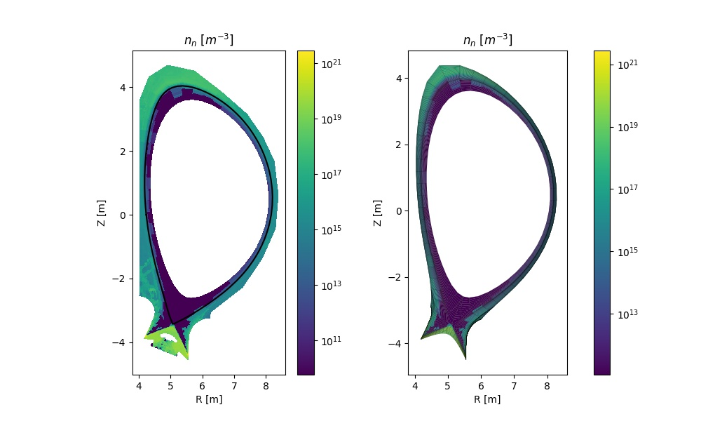

Interfacing with external codes
===============================

Aurora offers tools to interface with several widely used transport code, e.g. for post-processing of code results.

Interfacing with SOLPS-ITER
---------------------------

While running SOLPS-ITER is a complex task, reading and processing its results does't need to be. Aurora offers a convenient Python interface to rapidly load results, set them to convenient data arrays, plot on 1D or 2D grids, etc.

Here's an example of how you could load a SOLPS-ITER run and create some useful plots:

.. literalinclude:: ../examples/solps_example.py

In this example, we are first loading a SOLPS-ITER case from MDS+, using the default server and tree which are set for Asdex-Upgrade. These MDS+ settings can be easily changed by looking at the docstring for :py:class:`~aurora.solps.solps_case`. The alternative of loading SOLPS output from files on disk (`b2fstate` and `b2fgmry`, in this case) is also shown.

The instantiation of a :py:class:`~aurora.solps.solps_case` object enables a large number of operations based on the SOLPS output. The second part of the script above shows how one can plot 2D data on the B2 grid. The last section demonstrates how the EIRENE output can be displayed both on the B2 grid, on which it is interpolated by SOLPS, or on the native EIRENE grid.

.. warning::
    EIRENE results can only be displayed on the EIRENE mesh if EIRENE (`fort.*`) output files are provided. At present, SOLPS output saved to MDS+ trees only provides EIRENE results interpolated on the B2 mesh. 

In the original `Plasma Physics & Fusion Energy <https://iopscience.iop.org/article/10.1088/1361-6587/ac2890>`_ paper on Aurora, an example of processing SOLPS-ITER output for the ITER baseline scenario was described. Some example figures produced via the methods shown above are displayed here below.

.. note::
   Note that no SOLPS results are not distributed with Aurora. You must have the output of a SOLPS-ITER run available to you in order to try out these Aurora capabilities. 

.. figure:: figs/aurora_solps_iter.jpg
    :align: center
    :alt: example of SOLPS-ITER output
    :figclass: align-center

    Example of electron density and temperature + atomic D/T neutral density and temperature from a SOLPS-ITER simulation of ITER

    Comparison of D/T atomic neutral density on the B2 and EIRENE grids. 

Aurora capabilities to post-process SOLPS results can be useful, for example, to assess synthetic diagnostics for the edge of a fusion device. For this purpose, the :py:meth:`~aurora.solps.solps_case.eval_LOS` method can help to extract a specific data field from the loaded SOLPS case, interpolating resuls along a line-of-sight (LOS) that goes between two spatial (3D) points. This, combined with Aurora's capability to examine and simulate atomic spectra, reduces the technical barrier to investigate edge physics.

Interfacing with OEDGE
----------------------

OEDGE is a simulation package developed around DIVIMP, a Monte Carlo impurity transport code for the plasma edge. OEDGE allows one to load plasma backgrounds from either EDGE2D-EIRENE or B2-EIRENE, or to create approximate backgrounds based on Onion-Skin Modeling (OSM) coupled with EIRENE. Use of the OSM-EIRENE scheme is itself an interesting application of OEDGE.

Aurora includes tools to read OEDGE input files and read/postprocess its results. The following code illustrates how one may run an OEDGE simulation, load and postprocess its results in order to evaluate Balmer line A&M components, using the AMJUEL rates from the EIRENE package:

.. literalinclude:: ../examples/oedge_am_postprocessing.py