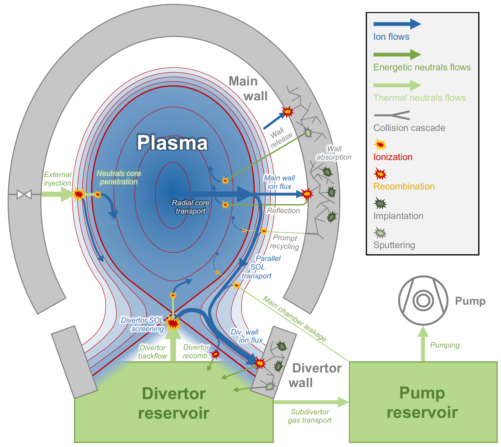

Physical model
==============

Aurora features a 1.5D impurity transport model for the plasma, which involves solving continuity equations for each charge state over time onto a 1D radial coordinate, and treating parallel SOL transport towards the divertor by including a parallel loss term active only outside the LCFS. Particle fluxes reaching main and divertor walls can become stored in the wall surfaces (constituting 0D dynamic particles reservoirs) or be recycled. Particles leaving the main wall become a new source for the plasma, while particles leaving the divertor wall will fill a further 0D dynamic neutral particles reservoir. From here, particles can flow back towards the plasma or be transported towards the pump, from which they are permanently removed from the system.

The following sketch summarized the various particles reservoirs, fluxes and physical processes present in Aurora, which will be anyway further explained in the following paragraphs.

    Reservoirs, fluxes and processes included in Aurora simulations

Magnetic geometry
-----------------

The model features a 1D coordinate for the plasma, assiming flux-surface-averaged quantities in a cylindrical geometry. The toroidicity is taken into account computing the quantities per unit of `length` of the cyclinder, and then multiplying then by the actual circular length in the toroidal direction (i.e. :math:`2 \pi R_0`, with :math:`R_0` being the major radius at the magnetic axis).

The considered spatial coordinate is :math:`r = \sqrt{V/(2 \pi^2 R_0)}`, where :math:`V` is the volume enclosed in the relative flux surface. For axially symmetric plasma geometries (e.g. tokamaks) this becomes equivalent to a radial coordinate, therefore in the output visualization it can be easily converted to other experimentally relevant coordinates, such as :math:`\rho_{pol}` or :math:`\rho_{tor}`. However, since the definition of :math:`r` is more general, containing information about 2D flux surface volumes, it may be applied also to non axially symmetric plasma geometry (e.g. stellarators).

The :math:`\rho_{vol}` coordinate is extended outside the LCFS into the SOL considering the major radii at the HFS and LFS midplanes, allowing to roughly estimate the particle fluxes towards the radial boundary of the grid, as well the parallel particle losses outside the LCFS.

Impurity particle transport in the plasma
-----------------------------------------

Aurora solves a set of coupled continuity equation for an impurity ion `imp` on all its charge states `z`. Being the geometry cylindrical, the equations will read

    .. math::

        \frac{\partial n_{\text{imp},z}}{\partial t} = -\frac{1}{r} \frac{\partial}{\partial r}\left( r \Gamma_{\text{imp},z}\right) + Q_{\text{imp},z}

The radial (cross-field) particle flux is computed, at each point of the radial grid, assuming separate diffusive and convective components, i.e.

    .. math::

        \Gamma_{\text{imp},z} = -D_z \frac{\partial n_{\text{imp},z}}{\partial r} + v_z n_{\text{imp},z}

where :math:`D_{z}` is the diffusion coefficients, in :math:`\text{cm}^2/\text{s}`, and :math:`v_{z}` is radial convective velocity, in :math:`\text{cm}/\text{s}`, for the charge state `z` at that point of the radial grid. These coefficients are completely user-defines for all charge states on the entire radial grid.

For each charge state, the atomic sources/sinks can be expressed as

    .. math::

        Q_{\text{imp},z} = & - \left( n_e S_{\text{imp},z}^{\text{ion}} + n_e \alpha_{\text{imp},z}^{\text{rec}} + n_n \alpha_{\text{imp},z}^{\text{CX}} \right)n_{\text{imp},z} \\\\
        & + \text{ } n_e S_{\text{imp},z-1}^{\text{ion}}n_{\text{imp},z-1} \\\\
        & + \left(n_e \alpha_{\text{imp},z+1}^{\text{rec}} + n_n \alpha_{\text{imp},z+1}^{\text{CX}}  \right)n_{\text{imp},z+1}

The first line expresses a sink due to ionization towards a higher charge state and recombination+CX towards a lower charge state. The second line expresses a source due to ionization from a lower charge state, and the third line expresses a source due to recombination+CX from a higher charge state. The relative coefficients are obtained from ADAS data.

The background kinetic plasma profiles, namely electron density :math:`n_e`, electron temperature :math:`T_e`, ion temperature :math:`T_i` and main species neutrals density :math:`n_{0,\text{main}}` will also be an input for the simulation, allowing to calculate the various atomic rates at each point of the grid.

Flux-surface-average of the radial transport equation
-----------------------------------------------------

Although assuming constant impurity densities and source terms on a flux surface, the radial particle flux might show a variation with the poloidal angle, which would require a full 2D geometry to be self-consistently computed. The reasons are the poloidally varying physical distance between two flux surface being shorter around the outer midplane than around the inner midplane, because of the Grad-Shafranov shift, and the 1/R dependence of the toroidal magnetic field. This leads to a poloidal variation of density and temperature gradients which impact the radial impurity fluxes through an additional centrifugal effect.

In general, flux-surface-averaged transport coefficients might be computed knowing the exact variation of :math:`D_{z}` and :math:`v_{z}` along the poloidal angle, e.g. from the neoclassical transport theory. In Aurora, this can be included considering the user inputs as the transport coefficients at the outer midplane (which can be usually experimentally inferred), i.e. :math:`D_{z,LFS}`, :math:`v_{z,LFS}`, and using in the continuity equations the flux-surface-averaged coefficients given as

    .. math::

        D = D_{\text{LFS}} \frac{n_{\text{LFS}}}{\langle n \rangle} \left(\frac{\partial r}{\partial r_{\text{mid,out}}} \right)^2

    .. math::

        v = v_{\text{LFS}} \frac{n_{\text{LFS}}}{\langle n \rangle} \frac{\partial r}{\partial r_{\text{mid,out}}} + D \frac{\partial}{\partial r_{\text{mid,out}}} \left( \ln{\frac{n_{\text{LFS}}}{\langle n \rangle}} \right)

with :math:`n_{\text{LFS}}/\langle n \rangle` being a calculated factor accounting for poloidal density asymmetries.

Impurity sources in the plasma
------------------------------

The transport equation is not solved for the neutrals, but these act as a source for the first ionization stage.

The neutrals profile on the radial grid is estimated assuming the neutrals to enter the plasma with a given speed :math:`v_0`, calculated from the energy at which they are emitted. The resulting profile is

    .. math::

        n_{\text{imp},0}(r) \propto \frac{r_{edge}}{r} \exp{\left( - \int_{r}^{r_{edge}}\frac{n_e S_{\text{imp},0}^{\text{ion}}}{v_0} dr \right)}

with :math:`r_{edge}` being the outermost boundary of the grid, from which the neutrals are injected. The resulting profile will be decaying with decreasing radial coordinate, due to ionization. The injection energy will define how far the neutrals can penetrate into the plasma before being ionized, i.e. the radial point at which the decay will start.

Aurora can consider different injection energies for neutrals externally emitted (e.g. from gas puff source), which may be often thermal, and neutrals recycled from the wall surfaces, which may be either thermal or energetic depending on the release mechanism.

Particle fluxes towards walls
-----------------------------

Once outside the LCFS, the transport equations are solved adding an additional loss term in :math:`Q_{\text{imp},z}`, which estimates the number of particles lost per unit of time due to parallel transport. This is done dividing the parallel ion velocity in the SOL by a characteristic parallel SOL length, i.e.

    .. math::

        Q_{\text{imp},z}^{SOL,\parallel} = \frac{v_{\parallel}}{L_{\parallel}}

:math:`v_{\parallel}` is estimated multiplying the sound speed by a user-defined Mach number, with the former being calculated from the background plasma as

    .. math::

        c_s = \sqrt{\frac{k_B (\gamma_i T_i + T_e)}{m_{\text{main}}}}
        
The simulated impurity is assumed as fully entrained into the main ion parallel flow, therefore the mass of the main ion species is used in the calculation of :math:`c_s`.

Aurora considers the existance of a `limiter` radial location, :math:`r_{lim}`, being between the LCFS and the radial edge of the grid. Particles lost between :math:`r_{LCFS}` and :math:`r_{lim}` will travel towards the divertor, consituting the particle flux towards the divertor wall surface, therefore the relative parallel length, in the calculation of the loss term, will be connection length between midplane and divertor, :math:`L_{\parallel,div}`. Particles lost between :math:`r_{lim}` and :math:`r_{edge}`, instead, will not arrive towards the divertor because they will be intercepted by the limiter shadow prior to that, therefore the relative parallel length, :math:`L_{\parallel,lim}`, will be much shorter than :math:`L_{\parallel,div}`.

Therefore, the impurity particle flux reaching the main wall will be the sum of proper radial particle flux calculated at the outermost point of the radial grid, i.e. :math:`\Gamma_{edge}`, and the limiter loss component, i.e. :math:`\Gamma_{lim}`. The impurity flow travelling towards the divertor will be instead just given by the divertor loss component in the SOL. However, if the divertor plasma is sufficiently cold, part of these particles may recombine before striking the divertor wall surface as ions. Therefore, the impurity particle flux actually :math:`\Gamma_{div}` actually striking the surface will be only a fraction :math:`1-f_{rec}` of divertor parallel loss component in the SOL, with :math:`f_{rec}` being a user-defined input.

Plasma-wall interaction
-----------------------

Particle fluxes reaching main and divertor undergo the same types of plasma-material interaction. Both walls will constitute two dynamic particles reservoirs, being their surfaces filled up by stored impurity particles, which can be potentially released again in a successive time. These are expressed in terms of surface densities :math:`\sigma`, in :math:`\text{cm}^{-2}`, evaluated dividing the total number of stored impurity particles by the user-defined wall surfaces.

Impurities reaching a wall surface can be first reflected, according to a particle reflection coefficient :math:`R_{N}^{\text{imp}}`, extracted from the TRIM data. Therefore, they are immediately re-emitted, generally as energetic particles, carrying a relevant fraction of the original energy of the ion projectiles.

The part of the impurity flux which is not reflected `can be` stored at the wall surface. However, this is weighted against an user-defined `saturation value` of the surface of density of particles stored at the wall, :math:`\sigma_{\text{imp,wall}}^{\text{sat}}`. In this way, a fraction :math:`\frac{\sigma_{\text{imp,wall}}}{\sigma_{\text{imp,wall}}^{\text{sat}}}` of the non-reflected flux will be still immediately re-emitted from the wall surface as thermal promptly recycled neutrals. Only the remaining fraction :math:`\left( 1-\frac{\sigma_{\text{imp,wall}}}{\sigma_{\text{imp,wall}}^{\text{sat}}}\right)` will end up filling the wall reservoirm defining an `implanted impurity flux`

    .. math::

        \Gamma_{\text{imp,wall}}^{\text{impl}} = \Gamma_{\text{imp,wall}}\left(1-R_{N}^{\text{imp}}\right)\left( 1-\frac{\sigma_{\text{imp,wall}}}{\sigma_{\text{imp,wall}}^{\text{sat}}}\right)
        
Once in the wall reservoirs, particles are stuck. However, they can be released again, in a following time, due to sputtering through ion bombardment of the wall surfaces. The projectiles doing that will be, however, not only those of the simulated impurity itself, but also those of all the other species in the plasma, including main species and potentially other impurity species. Therefore, the wall fluxes of the impurities not included in the current simulation must be somehow defined by the user. In this way, the `sputtered impurity flux` leaving the wall surface will be 

    .. math::

        \Gamma_{\text{imp,wall}}^{\text{sput}} = \sum_{species} \Gamma_{s,\text{wall}}Y_{\text{imp}}^s C_{\text{imp,wall}}
        
with :math:`Y_{\text{imp}}^s` being the sputtering yield of the impurity `imp` implanted in the wall surface from the projectile `s`, also extracted from the TRIM data, and :math:`C_{\text{imp,wall}}` the dynamic impurity concentration in the wall surface. These neutrals will be also energetic, carrying a relevant fraction of the original energy of the ion projectiles.

If the main wall is considered, then the reflected/promptly recycled/sputtered particles are emitted towards the plasma, constituting a new neutrals source component in the following time step.

Reflection and sputtering coefficients strongly depend on the impact energy of the ion projectiles onto the wall surfaces, which must be imposed by the used.

In the current version of Aurora, the complete plasma-wall interaction model as just described only for a single impurity, i.e. He, implanted in a single wall material, i.e. W.

Alternatively, a more simple plasma-wall interaction model, based on empirical user-defined coefficients, can be employed. This considers an empirical recycling coefficient :math:`R`, defined in such a way that a fraction :math:`R` of the particle flux reaching the walls enters a `dynamic` wall reservoir, from which particles can be emitted again towards the plasma over a time scale given by a wall recycling time :math:`\tau_{\text{wall},rec}`, i.e. as

    .. math::

        \Gamma_{\text{imp,wall}}^{\text{emit}} = \frac{N_{\text{imp}}^{\text{wall}}}{\tau_{\text{wall},rec}}
        
with

The remaining fraction :math:`1-R`, instead, becomes permanently stuck at the wall, and therefore will never return to the plasma. If the simplified model is used, the user does not need to specify the wall surfaces, being the adimensional total number of particles temporarily retained at the walls the only relevant variable.

Neutral recycling and pumping
-----------------------------

The parallel impurity SOL towards the divertor will ultimately constitute a dynamic reservoir of neutral particles, the `divertor reservoir`. This is filled up by the particles recycled from the divertor wall (reflected, promptly recycled or sputtered) and by the fraction :math:`f_{rec}` of the parallel impurity flow in the SOL which recombine even before interacting with the divertor wall. The content of this reservoir is expressed in terms of volume density :math:`n`, in :math:`\text{cm}^{-3}`, evaluated dividing the total number of contained impurity particles by the user-defined reservoir volume.

Because of a non-perfect retention of impurity particles in the divertor, some of the particles in the divertor might be ionized again in a following time, coming back to plasma. Since the intrinsic 2D geometry of the divertor cannot be properly accounted by a 1D code as Aurora, this process is emulated defining a loss term from the divertor reservoir over a time scale given by a user-defined divertor retention time  :math:`{\tau_{\text{div},ret}}`, such that the `backflow` towards the plasma will be

    .. math::

        \Gamma_{\text{imp}}^{\text{back}} = \frac{n_{0,\text{imp}}^{\text{div}} V_{0}^{\text{div}}}{\tau_{\text{div},ret}}
        
Part of this backflow will be `screened` in the divertor SOL, namely will be ionized already in the open-field-line region, while only the remaining part will penetrate further and be ionized in the core plasma. Therefore, a fraction :math:`f_{screen}` of :math:`\Gamma_{\text{imp}}^{\text{back}}` will actually immediately return towards the divertor wall surface, adding to the parallel SOL loss flow (effectively emulating the experimentally observed flux amplification on the divertor targets), while only the remaining fraction :math:`1-f_{screen}` will constitute an actual further neutrals source for the plasma. :math:`f_{screen}` will be also an empirical user-imposed parameter.

The particles which do not flow back from the divertor, can travel towards a further neutrals reservoir, the `pump reservoir`. This transport will be defined through a neutral transport conductance :math:`L`, in :math:`\text{cm}^3/\text{s}` such that the neutrals flow from divertor towards pump is given by

    .. math::

        \Gamma_{\text{imp}}^{\text{div-pump}} = L\left(n_{0,\text{imp}}^{\text{div}}-n_{0,\text{imp}}^{\text{pump}}\right)
        
where :math:`L` can be imposed by the user in order to reproduce the desired density drop between divertor and pump.

Finally, particles in the pump reservoir can leak again towards the plasma, with a user-imposed leaking conductance :math:`L_{\text{leak}}`, or can be permamently removed from the system through actual pumping, with a pumped flux

    .. math::

        \Gamma_{\text{imp}}^{\text{out}} = S_{\text{pump}}n_{0,\text{imp}}^{\text{pump}}
        
with :math:`S_{\text{pump}}` being a user-imposed pumping speed, in :math:`\text{cm}^3/\text{s}`.

The presence of a pump reservoir before the actual pump is optional, namely particles might be also pumped directly from the divertor, with :math:`S_{\text{pump}}` acting, in this case, on the divertor reservoir.

Finally, it is possible to use also a simplified model for the pumping, in which the particles removal from the divertor is defined through an empirical pumping time :math:`\tau_{\text{pump}}` such that the pumped flux is

    .. math::

        \Gamma_{\text{imp}}^{\text{out}} = \frac{N_{0,\text{imp}}^{\text{div}}}{\tau_{pump}}

If the simplified model is used, the user does not need to specify the divertor reservoir volume, being the adimensional total number of particles in the divertor the only relevant variable.

Numerical algorithm
-------------------

The transport equation in the plasma is solved by default through a vertex-centered, finite-volume discretization scheme using adaptive upwinding for the spatial discretization of the convective terms, depending on the value of the Péclet number :math:`\mu_i =|v(r_i)|\Delta r_i / D(r_i)` at any given point :math:`i` of the radial grid.

The conservative form of the transport equation for the density

    .. math::

        \overline{n}_i(r_i,t) = \frac{\int_{\Omega_i} r n(r,t) dr}{\int_{\Omega_i} r dr}

averaged over the cell :math:`\left[ r_{i-1/2},  r_{i+1/2} \right]` is

    .. math::

        \frac{\partial \overline{n}_i}{\partial t} = \frac{2}{r^2_{i+1/2}-r^2_{i-1/2}} \left[ r D \frac{dn}{dr} - rvn \right] _{r_{i-1/2}} ^{r_{i+1/2}} + \overline{Q}_i

The following replacements for the transport coefficients are applied:

    .. math::

        \tilde{D}_{i \pm} = \frac{r_{i \pm 1/2}}{\mp(r^2_{i+1/2}-r^2_{i-1/2})(r_i - r_{i \pm 1})} D_{i \pm 1/2}

    .. math::

        \tilde{v}_{i \pm} = \frac{r_{\pm 1/2}}{2(r^2_{i+1/2}-r^2_{i-1/2})} v_{i \pm 1/2}

The time discretization is performed by equally weighting the density contributions from previous and new time step (:math:`\partial \overline{n}_i / \partial t = (1/2)F(\overline{n}_i^{j+1})+(1/2)F(\overline{n}_i^{j})`). In this way, for a time step :math:`\Delta t` such that :math:`t^{j+1} = t^{j} + \Delta t`, we will have

    .. math::

       \overline{n}_i^{j+1} + \overline{n}_i^{j} & = \Delta t \overline{Q}_i \\\\
        & + \Delta t \left[ \tilde{D}_{i-} + \left[ 1 + K_{i-1/2} \right] \tilde{v}_{i-} \right] \left( \tilde{n}_{i-1}^{j+1} + \tilde{n}_{i-1}^j  \right) \\\\
        & - \Delta t \left[ \tilde{D}_{i-} - \left[ 1 - K_{i-1/2} \right] \tilde{v}_{i-} \right] \left( \tilde{n}_{i}^{j+1} + \tilde{n}_{i}^j  \right) \\\\
        & + \Delta t \left[ \tilde{D}_{i+} - \left[ 1 + K_{i+1/2} \right] \tilde{v}_{i+} \right] \left( \tilde{n}_{i}^{j+1} + \tilde{n}_{i}^j  \right) \\\\
        & + \Delta t \left[ \tilde{D}_{i+} - \left[ 1 - K_{i+1/2} \right] \tilde{v}_{i+} \right] \left( \tilde{n}_{i+1}^{j+1} + \tilde{n}_{i+1}^j  \right) \\\\

Defining the parameter :math:`K_i = \text{max}(0,1-2/|\mu_i|)\times\text{sgn}(\mu_i)`, in the limit :math:`\mu_i \rightarrow 0` (diffusion-dominated transport) a purely central scheme (:math:`K_i = 0`) is adopted, while in the limit :math:`\mu_i \rightarrow \infty` (convection-dominated transport) pure upwinding (:math:`K_i = 1`) is adopted.

Atomic rates act on each charge state considering ionization and recombination in two half steps. In the first half step, the ionization term is computed using the density at the new timestep and recombination with the density at the previous time step. In the second half step, ionization is computed at the previous time step and recombination at the new time step.

Finally, the time descretization of the evolution of the particle content :math:`N` in the 0D reservoirs is done through a standard finite differences scheme, namely

    .. math::

       N^{j+1} = N^{j}\left( 1 - \frac{\Delta t}{\tau_{depl}} \right) + Q_j \Delta t

with :math:`\tau_{depl}` being the characteristic time scale for depletion of the particle content in the reservoir, if appliable, and :math:`Q_j` being the global source/sink term.