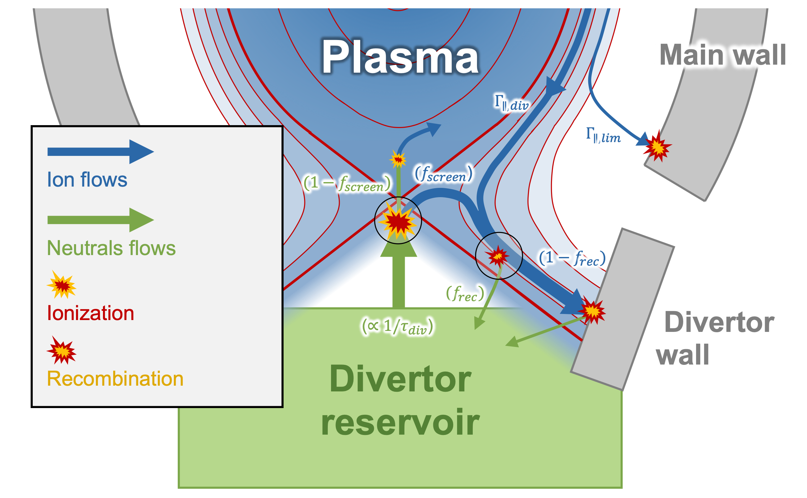

Input parameters
================

In this page, we describe the input parameters for Aurora simulations. Since all Aurora inputs are created in Python, rather than in a low-level language, users are encouraged to browse through the module documentation to get a complete picture; here, we only look at some specific features.

All parameters are provided with a default value (an integer, a float, a string, a list...). Before running a simulation, a dictionary containing all input parameters coupled to their default values can be called with::

  import aurora
  namelist = aurora.default_nml.load_default_namelist()

Before using this to set up the simulation, any input parameters contained in it might be conveniently changed by the user with::

  namelist['parameter_to_be_changed'] = (desired_value)

Only after the user has changed all the input parameters in `namelist`, the input dictionary for the simulation `asim` can be created by the main inizialitation class :py:class:`~aurora.core.aurora_sim`, using the input parameters as present in the namelist, with::

  asim = aurora.core.aurora_sim(namelist, geqdsk=geqdsk)

Tables in the following sections describe all the available input parameters to Aurora's forward model of ion transport contained in the default namelist, together with their default value.

Impurity and main species
-------------------------

.. list-table::
   :widths: 20 20 60
   :header-rows: 1

   * - Parameter
     - Default
     - Description
   * - `imp`
     - Ca
     - Atomic symbol of the simulated ion species.
   * - `main_element`
     - D
     - Atomic symbol of the background ion species.
     
In principle, any atomic element may simulated as ion species in Aurora simulations. The background ion species instead may often be an hydrogen isotope (for which a distinction between `H`, `D` and `T` is recognized).

Time grid
---------

.. list-table::
   :widths: 20 20 60
   :header-rows: 1
     
   * - Parameter
     - Default
     - Description
   * - `timing["times"]`
     - [0.  0.1]
     - Times at which intervals/cycles change. See detailed description below.
   * - `timing["dt_start"]`
     - [1.e-05 1.e-03]
     - `dt` values at the beginning of each interval/cycle. See detailed description below.
   * - `timing["dt_increase"]`
     - [1.005 1.   ]
     - `dt` multipliers at every time step change. See detailed description below.
   * - `timing["steps_per_cycle"]`
     - [1 1]
     - Number of steps before `dt` is multiplied by a `dt_increase` value. See detailed description below.
     
The input parameters concerning the creation of the time grid for a simulation are contained in the sub-dictionary `timing` in the default namelist.

In order to save computational time, it is possible to choose small time steps at the beginning of a simulation, which will however increase in duration will time, while the simulation might tend to converge. For cases in which the external particle source and/or the transport are set to strongly change in time, setting a time step which stays constant and small might be more appropriate.

The lists `time`, `dt_start`, `dt_increase` and `steps_per_cycle` must contain N+2 elements:

* The values in `times`, the first value will indicate the start time of the simulation, the last value will indicate the end time of the simulation, while the optional N values in between will indicate the times at which the time grid specification is wanted to change.

* The values in `dt_start` will indicate the initial duration of the time step in each of the "cycles" which start at the times contained in `times`.

* The values in `dt_increase` will indicate the multiplication factor by which the duration of the time steps will increase within each of the relative "cycles".

* The values in `steps_per_cycle` will indicate the number of time steps, within each cycle, before the step duration is multiplied again by `dt_increase`.

The time grid will be created, according to these parameters, by a Fortran routine called by the function :py:func:`~aurora.grids_utils.create_time_grid`. Let's test the creation of a grid using a sample dictionary `timing` and plot the result::

  import aurora
  namelist = aurora.default_nml.load_default_namelist()
  
  namelist['timing']['times'] = [0.,0.5, 1.]
  namelist['timing']['dt_start'] = [1e-4,1e-4,1e-4]  # last value not actually used, except when sawteeth are modelled!
  namelist['timing']['steps_per_cycle'] = [5, 5, 1]   # last value not actually used, except when sawteeth are modelled!
  namelist['timing']['dt_increase'] = [1.005, 1.02, 1.0]  # last value not actually used, except when sawteeth are modelled!
  
  time, save = aurora.create_time_grid(namelist['timing'], plot=True)
  

    Time grid produced by the create_time_grid function

As we can see, the time grid is extended in the time window [0.0, 1.0] s, with cycles beginning at the times 0.0 s and 0.5 s respectively, both with initial time step duration of 1e-4 s. This duration is multiplied by multiplication factors, each 5 time steps, different between the two cycles. The plot will also say how many time steps are actually saved as of the time grid (given by the `time` output). The `save` output is a list of 0's and 1's that is used to indicate which time grid points should be saved to the output.
     
Radial grid
-----------

.. list-table::
   :widths: 20 20 60
   :header-rows: 1 
   
   * - Parameter
     - Default
     - Description
   * - `K`
     - 6.0
     - Exponential grid resolution factor. See detailed description below.
   * - `dr_0`
     - 0.3
     - Radial grid spacing on axis. See detailed description below.
   * - `dr_1`
     - 0.05
     - Radial grid spacing near the wall. See detailed description below.
   * - `lim_sep`
     - 1.0
     - Distance between nearest limiter and plasma separatrix [cm].
   * - `bound_sep`
     - 2.0
     - Distance between wall boundary and plasma separatrix [cm].
   * - `SOL_decay`
     - 0.05
     - Decay length at the wall bounday, numerical parameter for the last grid point.
     
The radial grid for Aurora simulations, namely the list of values of the default flux-surface-volume normalized coordinate :math:`r` constituting the centers of the radial locations of the grid cells, is generated in such a way to have equally spaced values of the auxiliary coordinate

    .. math::

        \rho = \frac{r}{\Delta r_{centre}} + \frac{r_{edge}}{k+1} \left(\frac{1}{\Delta r_{edge}}- \frac{1}{\Delta r_{centre}} \right) \left(\frac{r}{r_{edge}} \right)^{k+1}
        
with the corresponding radial step size given then by

    .. math::

        \Delta r = \left[\frac{1}{\Delta r_{centre}} + \left(\frac{1}{\Delta r_{edge}} - \frac{1}{\Delta r_{centre}} \right) \left(\frac{r}{r_{edge}}\right)^k \right]^{-1}

The input parameters needed to define the radial grid are:

* The `k` factor in the above formulae: large values give finer grids at the plasma edge. A value of 6 is usually appropriate.

* `dr_0` = :math:`\Delta r _{centre}` and `dr_1` = :math:`\Delta r _{edge}` give the radial spacing (in :math:`r` units, i.e. in cm) at the first and at the last grid point respectively.

* :math:`\Delta r_{lim}` = `lim_sep`, defining the radial distance between the LCFS and the limiter shadow given in flux-surface-volume normalized unit (cm): the parallel losses taking place in this region will be directed towards the divertor wall.

* :math:`\Delta r_{wall}` = `bound_sep`, defining the radial distance between the LCFS and the wall boundary (i.e. the actual end point of the radial grid) given in flux-surface-volume normalized unit (cm): the parallel losses taking place in this region will intercept a limiter and therefore will be directed towards the main wall, as well as the radial particle flux at the outermost grid point.

* The :math:`r_{edge}` value in the above formulae is the :math:`r` coordinate at the outermost grid point, defined as :math:`\Delta r_{LCFS} + \Delta r_{wall}`, where :math:`\Delta r_{LCFS}` is the distance between plasma center and LCFS, given in flux-surface-volume normalized unit.

The value of :math:`\Delta r_{LCFS}` is automatically computed by the main aurora class inizialitation, based on the provided `geqdsk` equilibrium file. While the value of :math:`\Delta r_{wall}` may be also estimated via the :py:func:`~aurora.grids_utils.estimate_boundary_distance` function, in an `aeqdsk` structure file is provided as well (alternatively, users may set it to anything they find appropriate).

The radial grid will be created, according to these parameters, by the function :py:func:`~aurora.grids_utils.create_radial_grid`. Let's test the creation of a grid using a sample dictionary `namelist` and plot the result::

  import aurora
  namelist = aurora.default_nml.load_default_namelist()
  
  namelist['K'] = 6.
  namelist['dr_0'] = 1.0  # 1 cm spacing near axis 
  namelist['dr_1'] = 0.1   # 0.1 cm spacing at the edge
  namelist['rvol_lcfs'] = 50.0 # cm, minor radius (in rvol units)
  namelist['lim_sep'] = 3.0 # cm, distance between LCFS and limiter shadow
  namelist['bound_sep'] = 5.0  # cm, distance between LCFS and wall boundary

  rvol_grid, pro_grid, qpr_grid, prox_param = aurora.create_radial_grid(namelist, plot=True)
  
  

    Radial grid produced by the create_radial_grid function

The plot shows the radial spacing over the grid, highlighting the locations of LCFS and limiter, also specifying the total number of grid points. As we can see, the radial steps are made smaller towards the edge, where higher gradients can be expected.
     
Kinetic profiles
----------------

.. list-table::
   :widths: 20 20 60
   :header-rows: 1
  
   * - Parameter
     - Default
     - Description 
   * - `kin_profs["ne"]`
     - {'fun': 'interpa', 'times': [1.0]}
     - Specification of electron density [:math:`cm^{-3}`]. `fun="interpa"` interpolates data also in the SOL.
   * - `kin_profs["Te"]`
     - {'fun': 'interp', 'times': [1.0], 'decay': [1.0]}
     - Specification of electron temperature [:math:`eV`]. `fun="interp"` sets decay over `decay` length in the SOL.
   * - `kin_profs["Ti"]`
     - {'fun': 'interp', 'times': [1.0], 'decay': [1.0]}
     - Specification of ion temperature [:math:`eV`]. Only used for charge exchange rates.
   * - `kin_profs["n0"]`
     - {'fun': 'interpa', 'times': [1.0]}
     - Specification of background (H-isotope) neutral density [:math:`cm^{-3}`].   
     
The input parameters concerning the specification of the background kinetic plasma profiles for a simulation are contained in the sub-dictionary `kin_profs` in the default namelist. All profiles might be given as constant in time (i.e. the same for all the time steps of the simulation), or different profiles for arbitrarily different time points might be imposed. Kinetic profiles might be provided by experimental data, as well by more advanced transport core/edge codes such as ASTRA or SOLPS.

The specification of background kinetic plasma profiles is needed for computing the ADAS atomic rates. Since at least the specification of ionization and recombination rates is mandatory, the specification of electron density (`ne`) and temperature (`Te`) is strictly needed. In order to also include charge-exchange contributions to the atomic source/sink term (which is optional), we need to specify also an ion temperature (`Ti`) and the neutral density of the hydrogenic main species isotope (`n0`). In the latter case, `Ti` may be provided by the user or, alternatively, it may be set equal to `Te`. `n0`, instead, should be explicitly provided.

Note that, in the evaluation of charge-exchange rates, what is used is not strictly the ion temperature, but the effective ("reduced") energy of the neutral-impurity interaction given by :math:`T_{red}=(m_{main} T_n + m_{imp} T_i)/(T_n+T_i)`, where :math:`m_{main}` is the mass of the background main ion species and :math:`T_{n}` is the background neutral temperature.

`ne`, `Te` and `Ti` are also used to compute the sound speed of the parallel plasma flow in the SOL.

Each field of `kin_profs` is in turn a sub-dictionary which must contains the following values:

*  `fun` corresponds to a specification of interpolation functions in Aurora. Users should choose whether to interpolate data as given also in the SOL (`fun=interp`) or if SOL profiles should be substituted by an exponential decay. In the latter case, a decay scale length (in :math:`cm` units) should also be provided as `decay`.
*  `times` is a 1D array of times, in seconds, at which time-dependent profiles are given. If only a single value is given, whatever it may be, profiles are taken to be time independent.
*  `rhop` is a 1D array of radial grid values, given as square-root of normalized poloidal flux :math:`\rho_{pol}`.
*  `vals` is a 2D array of values of the given kinetic quantity. The first dimension is expected to be time, the second radial coordinate. 
     
Let's test the declaration of some sample kinetic profile in an appropriate way in the input namelist, and plot them::

  import aurora
  import numpy as np
  import matplotlib.pyplot as plt
  
  namelist = aurora.default_nml.load_default_namelist()

  rhop = namelist["kin_profs"]["ne"]["rhop"] = namelist["kin_profs"]["Te"]["rhop"] = np.linspace(0, 1, 100)
  ne = namelist["kin_profs"]["ne"]["vals"] = (1e14 - 0.4e14) * (1 - rhop ** 2) ** 0.5 + 0.4e14
  Te = namelist["kin_profs"]["Te"]["vals"] = (5000 - 100) * (1 - rhop ** 2) ** 1.5 + 100

  fig, ax = plt.subplots(nrows=1, ncols=2, figsize=(14, 5))
  ax[0].plot(rhop,ne)
  ax[1].plot(rhop,Te)
  ax[0].set_xlabel(r'$\rho_p$')
  ax[1].set_xlabel(r'$\rho_p$')
  ax[0].set_ylabel('$n_e$ [cm$^{{-3}}$]')
  ax[1].set_ylabel('$T_e$ [eV]')
  ax[0].set_ylim((0,None))
  ax[1].set_ylim((0,None))
  

    Sample kinetic profiles
     
Atomic physics
--------------

.. list-table::
   :widths: 20 20 60
   :header-rows: 1

   * - Parameter
     - Default
     - Description  
   * - `scd`
     - `None`
     - ADAS ADF11 SCD file (ionization rates).
   * - `acd`
     - `None`
     - ADAS ADF11 ACD file (recombination rates).
   * - `ccd`
     - `None`
     - ADAS ADF11 CCD file (charge-exchange rates).
   * - `cxr_flag`
     - False
     - If True, activate charge-exchange recombination with background thermal neutrals.
   * - `nbi_cxr_flag`
     - False
     - If True, activate charge-exchange recombination with energetic NBI neutrals.
   * - `nbi_cxr`
     - {'rhop': None, 'vals': None}
     - Radial profiles of charge-exchange rates from NBI neutrals for each simulated charge state.
   * - `superstages`
     - []
     - Indices of charge states that should be kept as superstages.
     
Aurora allows choosing the specific file to use for reading the ADAS atomic data employed by the simulation, through the inputs:

*  `scd`: ADAS ADF11 SCD file containing the ionization rates for the chosen impurity ion species.

*  `acd`: ADAS ADF11 ACD file containing the recombination rates for the chosen impurity ion species.

*  `ccd`: ADAS ADF11 CCD file containing the nl-unresolved charge-exchange for the chosen impurity ion species with the chosen background neutral species.

If left to None, the default files specified in the :py:func:`~aurora.adas_files.adas_files_dict` function are used. Otherwise, the complete name of specific files can be set by the user (e.g. `scd`: 'scd89_ar.dat', `acd`: 'acd89_ar.dat').

Let's try loading the default atomic files for He using the :py:func:`~aurora.atomic.get_atom_data` function::

  import aurora
  
  namelist = aurora.default_nml.load_default_namelist()
  imp = 'He'
  
  atom_files = {}
  atom_files["acd"] = namelist.get(
      "acd", aurora.adas_files.adas_files_dict()[imp]["acd"]
  )
  atom_files["scd"] = namelist.get(
      "scd", aurora.adas_files.adas_files_dict()[imp]["scd"]
  )
  atom_files["ccd"] = namelist.get(
          "ccd", aurora.adas_files.adas_files_dict()[imp]["ccd"]
  )

  atom_data = aurora.atomic.get_atom_data(imp, files=atom_files)

We will have a dictionary `atom_data` containing one tuple for each type of desired rate. Each tuple will, in turn, contain:

*  The electron density grid of the requested rate, in units of :math:`\log_{10}(n_e [\text{cm}^{-3}])` (first element).

*  The electron temperature grid of the requested rate, in units of :math:`\log_{10}(T_e [\text{eV}])` (second element).

*  The requested rate, in function of (:math:`z`, :math:`T_e`, :math:`n_e`), in units of :math:`\text{cm}^{-3}\text{s}^{-1}` (third element).

Now let's extract ionization and recombination rates for the first ionization stage (i.e. for the transitions :math:`z=0 \leftrightarrow z=1`) and plot them on the ADAS-provided :math:`T_e` grid::

  import matplotlib.pyplot as plt
  
  Te, Sne, Rne, _ = aurora.atomic.get_cs_balance_terms(
      atom_data,
      ne_cm3=1e14,
  )
  
  fig, ax = plt.subplots()
  ax.plot(Te,Sne[:,0],label='ionization')
  ax.plot(Te,Rne[:,0],label='recombination')
  ax.legend()
  ax.set_xlabel('$T_e$ [eV]')
  ax.set_ylabel('[cm$^{{-3}}$s$^{{-1}}$]')
  ax.set_xscale('log')
  ax.set_yscale('log')
  ax.set_ylim(1e1,1e7)
  

    ADAS ionization and recombination rates
    
During a simulation, ionization and recombination rates must be always used, to compute the transition of the simulated impurity between its atomic stages. This requires having imposed background :math:`n_e` and :math:`T_e` profiles, to interpolate the ionization and (radiative+dielectric) recombination rates onto the radial grid. Optionally, charge-exchange rates between the charged impurity stages and the background neutrals can be also used to compute an "effective" recombination for such stages (which includes also the CX component), if:

*  `cxr_flag` is True. This activates charge-exchange recombination with the background thermal neutrals whose profile is speficied in `kin_profs["n0"]`

*  `nbi_cxr_flag` is True. This activates charge-exchange recombination with the energetic NBI neutrals. The corresponding charge-exchange rates must be manually imposed in the `nbi_cxr` sub-dictionary.

Finally, if the superstage model is used to bundle together groups of neighboring charge states in the computation of the transport equation, the parameter `superstages` must contain the indices of charge states that should be kept as superstages. If this is empty (default), then all the charge states are separately considered.

External particle sources
-------------------------

.. list-table::
   :widths: 20 20 60
   :header-rows: 1

   * - Parameter
     - Default
     - Description 
   * - `source_type`
     - 'const'
     - Type of ion source. See detailed description below.
   * - `source_rate`
     - 1e+21
     - Externally injected flux (in ions/s), if `source_type` = 'const' or 'step'.
   * - `step_source_duration`
     - `None`
     - (Optional) Duration of a single step source (in s), if `source_type` = 'step'.
   * - `src_step_times`
     - `None`
     - (Optional) List of times defining multiple step sources (in s), if `source_type` = 'step'.
   * - `src_step_rates`
     - `None`
     - (Optional) List of injected fluxes defining multiple step sources (in ions/s), if `source_type` = 'step'.
   * - `source_file`
     - `None`
     - Location of a formatted from while from which a time-dependent injected flux (in ions/s) is read, if `source_type` = 'file'.
   * - `explicit_source_vals`
     - `None`
     -  2D array for injected flux on `explicit_source_time` and `explicit_source_rhop` grids (in ions/s), if `source_type` = 'interp' or 'arbitrary_2d_source'.
   * - `explicit_source_time`
     - `None`
     -  Time grid for explicit injected flux (in s), if `source_type` = 'interp' or 'arbitrary_2d_source'.
   * - `explicit_source_rhop`
     - `None`
     - :math:`\rho_pol` grid for explicit injected flux, if `source_type` = 'arbitrary_2d_source'.
   * - `LBO["n_particles"]`
     - 1e+18
     - Number of particles in LBO synthetic source, if `source_type` = 'synth_LBO'.
   * - `LBO["t_fall"]`
     - 0.3
     - Decay time of LBO synthetic source, if `source_type` = 'synth_LBO'.
   * - `LBO["t_rise"]`
     - 0.05
     - Rise time of LBO synthetic source, if `source_type` = 'synth_LBO'.
   * - `LBO["t_start"]`
     - 0.0
     - Start time of LBO synthetic source, if `source_type` = 'synth_LBO'.
   * - `source_div_time`
     - `None`
     - (Optional) Time base for any particle sources going into the divertor reservoir (in s).
   * - `source_div_vals`
     - `None`
     - (Optional) Particle sources going into the divertor reservoir (in particles/s/cm).
     
Neutral particle sources in the plasma of the simulated ion species can be specified in a number of ways, depending on the value of `source_type`:

*  If `source_type` = 'const' a constant source (e.g. a gas puff) is simulated, with value given by `source_rate` (in ions/s).

*  If `source_type` = 'step' a source which suddenly appears and suddenly stops is simulated, i.e. a rectangular step. The duration of this step is given by the optional field 'step_source_duration'. Multiple step times can be given as a list in the optional field 'src_step_times' (in s); the amplitude of the source at each step is given in the optional field 'src_step_rates' (in ions/s).

*  If `source_type` = 'file' a simply formatted source file defined in the optional field `source_file`, with one time point and corresponding and source amplitude on each line, is read in. This can describe an arbitrary time dependence, e.g. as measured from an experimental diagnostic. 

*  If `source_type` = 'interp' the time history for the source is provided by the user within the `explicit_source_time` (in s) and `explicit_source_vals` (in ions/s) fields of the namelist dictionary and this data is simply interpolated.

*  If `source_type` = 'arbitrary_2d_source' an arbitrary time- and radially-dependent source is provided by the user within the `explicit_source_time` (in s), the `explicit_source_rhop` and `explicit_source_vals` (in ions/s) fields of the namelist dictionary.

*  If `source_type` = 'synth_LBO' model source from a laser blow-off injection is used, given by a convolution of a gaussian and an exponential. The required  parameters in this case are inside a `LBO` sub-dictionary, with fields `t_start`, `t_rise`, `t_fall`, `n_particles`. The `n_particles` parameter corresponds to the  amplitude of the source (the number of particles corresponding to the integral over the source function). 

The time history of neutral particle sources in the plasma is created by the :py:func:`~aurora.source_utils.get_source_time_history` function using the above specified parameters. Let's test the creation of an external source rate using a sample dictionary `namelist` and plot the result::

  import aurora
  import numpy as np
  
  namelist = aurora.default_nml.load_default_namelist()
  
  namelist['source_type'] = 'step'
  namelist['src_step_times'] = [0, 0.4 ,0.6]
  namelist['src_step_rates'] = [0, 1e20, 0]
  
  source_time_history = aurora.get_source_time_history(namelist, Raxis_cm = 50, time = np.linspace(0,1,1000), plot = True)

    Step source produced by the get_source_time_history function

Particle sources can also be specified such that they enter the simulation from the divertor neutrals reservoir. This parameter can be useful to simulate divertor puffing. Note that it can only have an effect if `recycling_flag` = True and `wall_recycling` is >=0, so that particles from the divertor are allowed to flow back to the plasma. In order to specify a source into the divertor, one needs to specify the two optional parameters:

* `source_div_time` : time base for the particle source into the divertor reservoir.
   
* `source_div_vals` : values of the particle source into the divertor reservoir.

Note that while fluxes injected into the plasma will give neutral particle sources here in units of :math:`particles/cm^3`, fluxes injected into the divertor reservoir will give a particle source in units of :math:`particles/cm/s`, since they are going into a 0D edge model.

Neutral source profiles
-----------------------

.. list-table::
   :widths: 20 20 60
   :header-rows: 1

   * - Parameter
     - Default
     - Description 
   * - `source_width_in`
     - 0.0
     - Inner gaussian source width (in cm), only used if > 0. See detailed description below.
   * - `source_width_out`
     - 0.0
     - Outer gaussian source width (in cm), only used if > 0. See detailed description below.
   * - `source_cm_out_lcfs`
     - 1.0
     - Source distance (in cm) from the LCFS.
   * - `imp_source_energy_eV`
     - 3.0
     - Energy of externally injected neutrals, in eV, used if `source_width_in=source_width_out=0`. See detailed description below.
   * - `imp_recycling_energy_eV`
     - 3.0
     - Energy of recycled neutrals, in eV, used if `source_width_in=source_width_out=0`. See detailed description below.
   * - `prompt_redep_flag`
     - False
     - If True, a simple prompt redeposition model is activated.
     
The radial distribution of neutral particle sources in the plasma of the simulated ion species (which will be a source for the first ionization stage) is specified, by default, as an exponentially decaying profile, due to ionization of these neutrals, travelling towards the plasma center, with decay starting only at the radial location until which the neutral particles can penetrate into the plasma before starting being ionized. Neutrals will be present only at radial locations inside the one specified by `source_cm_out_lcfs`, which gives the source location in distance from the LCFS.

The depth until which the neutrals can penetrate is defined by their velocity, which is in turn calculated from their kinetic energy as :math:`v = \sqrt{\frac{2 E_{kin}}{m_{imp}}}`. This energy is given by `imp_source_energy_eV` for externally injected neutrals, and by `imp_recycling_energy_eV` for neutrals re-emitted towards the plasma from main wall recycling, if the simple recycling model is used. If the values of `imp_source_energy_eV` and `imp_recycling_energy_eV` are < 0, then the velocity of external/recycled neutrals respectively is taken as the local thermal speed based on the local ion temperature.

Alternatively, if `source_width_in` and `source_width_out` are > 0, the source profile will be specified as a point-like source, with gaussian distribution, having inner and outer FWHM given by `source_width_in` and `source_width_out` respectively, centered around the location until which the neutral particles can penetrate into the plasma before starting being ionized.

The radial profiles of neutral particle sources in the plasma are created by the :py:func:`~aurora.source_utils.get_radial_source` function using the above specified parameters.
        
Sawteeth model
--------------

.. list-table::
   :widths: 20 20 60
   :header-rows: 1

   * - Parameter
     - Default
     - Description     
   * - `saw_model["saw_flag"]`
     - False
     - If True, activate sawteeth phenomenological model.
   * - `saw_model["rmix"]`
     - 1000.0
     - Mixing radius of sawtooth model. Each charge state density is flattened inside of this.
   * - `saw_model["times"]`
     - [1.0]
     - Times at which sawteeth occur.
   * - `saw_model["crash_width"]`
     - 1.0
     - Smoothing width of sawtooth crash [cm].
        
ELM model
---------

.. list-table::
   :widths: 20 20 60
   :header-rows: 1

   * - Parameter
     - Default
     - Description     
   * - `ELM_model["ELM_flag"]`
     - False
     - Convenience key for including ELM transport model. See detailed description below.
   * - `ELM_model["ELM_time_windows"]`
     - None
     - Windows within simulation time in which ELMs are desired. See detailed description below.
   * - `ELM_model["ELM_frequency"]`
     - [100]
     - Frequencies at which ELMs take place [Hz]. See detailed description below.
   * - `ELM_model["crash_duration"]`
     - [0.5]
     - Duration of transport rampup during ELMs [ms]. See detailed description below.
   * - `ELM_model["plateau_duration"]`
     - [1.0]
     - Duration of maximum transport phase during ELMs [ms]. See detailed description below.
   * - `ELM_model["recovery_duration"]`
     - [0.5]
     - Duration of transport rampdown during ELMs [ms]. See detailed description below.
   * - `ELM_model["ELM_shape_decay_param"]`
     - 2000
     - Parameter regulating time-dependent ELM parallel transport shape [s^-1]. See detailed description below.
   * - `ELM_model["ELM_shape_delay_param"]`
     - 0.001
     - Parameter regulating time-dependent ELM parallel transport shape [s]. See detailed description below.
   * - `ELM_model["adapt_time_grid"]`
     - False
     - Flag for adapting the time grid to ELM characteristics. See detailed description below.
   * - `ELM_model["dt_intra_ELM"]`
     - 5.e-05
     - Constant time step during ELMs if adapt_time_grid is True [s]. See detailed description below.  
   * - `ELM_model["dt_increase_inter_ELM"]`
     - 1.05
     - dt multiplier applied on time grid at each step if adapt_time_grid is True. See detailed description below.
     
Aurora also features a very simplified phenomenological model for ELM-induced transport at the pedestal, which automatically creates a time dependence for the transport coefficients according to user-defined inter- and intra-ELM transport profiles and to the parameters specified in the sub-dictionary `ELM_model` of the input namelist. Note that the transport coefficients need to be adapted by manally calling the :py:func:`~aurora.transport_utils.ELM_model` before running a simulation. See related tutorial for details.

The ELM model allows to define an abrubt increase of the transport coefficients, followed by an abrupt decrease, occurring cyclically during the simulation. The user will need two defines two separate radial profiles of the transport coefficients, one related to `inter-ELM times` and one related to `intra-ELM times`.

`ELM_time_windows` is a list of lists which defines one or more time windows within the entire simulation duration in which ELMs are desired. If None, then the ELMs take place for the entire duration of the simulation.

For every sub-window of time defined by `ELM_time_windows`, ELM characteristics are defined by the lists:

*  `ELM_frequency`, which are the frequencies (in Hz) at which ELMs take place in each cycle.

*  `crash_duration`, which are the time durations (in ms), within an ELM, in each cycle, during which the transport coefficients (at each radial location) are ramped up linearly from their inter-ELM values to their intra-ELM values.

*  `plateau_duration`, which are the time durations (in ms), within an ELM, in each cycle, during which the transport coefficients (at each radial location) stays constantly at their intra-ELM values.
 
*  `recovery_duration`, which are the time durations (in ms), within an ELM, in each cycle, during which the transport coefficients (at each radial location) are ramped down linearly from their intra-ELM values to their inter-ELM values.

This is, for example, how transport coefficients at some radial location may appear using `ELM_frequency` = 100 Hz, `crash_duration` = 0.5 ms, `plateau_duration` = 1.0 ms, `recovery_duration` = 0.5 ms:

    Automatic transport modulation performed by the ELM model

Additionally, if `ELM_flag` is True, the code will employ an ELM-driven time dependency for several other input parameters (e.g. Mach number and ion impact energy onto material walls). After setting an inter-ELM value and a peak ELM value for such parameters (see other paragraphs of this section), the code will use for these a time-dependent shape having the imposed inter-ELM value as baseline and the imposed peak ELM value as maximum value cyclically recurring with ELMs. The general time-dependent shape follows the theoretical intensity of the ELM-driven parallel transport as

    .. math::

        f_{ELM}(t) = \frac{1}{t^2} \exp{\left(-\frac{(1/\tau_{ELM,decay})^2}{2t^2}\right)}
        
The user can control such shape through the empirical input parameters :math:`\tau_{ELM,decay}` = `ELM_shape_decay_param`, in s^-1, which regulates the decay time of the shape function :math:`f_{ELM}(t)`, and `ELM_shape_delay_param`, in s, which regulates the delay of the onset of the peak of shape function with respect to each ELM cycle. The user must pay attention, when using the ELM model with such feature, to synchronize as much as possible the shape of this peak with the simulated time-dependent shape of the particle fluxes towards the walls, which will have also cyclic peaks due to ELMs. This is e.g. how an arbitrary input parameter, whose baseline is assigned to be 1 and its ELM-driven peak value is assigned to be 10, is modulated using the same ELM above, characteristics, if `ELM_shape_decay_param` = 2000 s^-1, after having manually synchronized it with the ELM transport adjusting `ELM_shape_delay_param`.

.. figure:: figs/ELM_parallel_transport_shape_modulation.png
    :align: center
    :width: 500
    :alt: Automatic modulation of an arbitrary input parameter performed by the ELM model
    :figclass: align-center 

    Automatic modulation of an arbitrary input parameter performed by the ELM model
    
Note that, in the current version of Aurora, the possibility of modulating other input parameters in this way is available only if the time grid has constant and equal time steps.

When running with ELMs, it is advisable to run a simulation with small (< 1e-4 s) and constant time steps. However, to save computation time, it is also possible to automatically adapt the time grid to the ELM characteristics, in order to get time steps cycles synchonized to ELMs featuring time steps which are small and constant during the maximum ELM transport phases, and which start to gradually increase again in duration when the ELM is over. This is done if `adapt_time_grid` is True, and regulated by:

*  `dt_intra_ELM`, which is the constant time step duration (in s) during intra-ELM phases.

*  `dt_increase_inter_ELM`, which is time step multiplied applied at every time steps in the inter-ELM phases.

This is, for example, how the time grid is adapted using `dt_intra_ELM` = 5e-5 s and `dt_increase_inter_ELM` = 1.05:

    Adaptation of time grid to ELM cycles
        
Note that, for what said before, the automatic adaptation of time grid to ELM cycle is not compatible yet with the abode described modulation of other input parameters.
       
Edge/divertor
-------------

.. list-table::
   :widths: 20 20 60
   :header-rows: 1

   * - Parameter
     - Default
     - Description    
   * - `clen_divertor`
     - 17.0
     - Connection length to the divertor [m].
   * - `clen_limiter`
     - 0.5
     - Connection length to the nearest limiter [m]
   * - `SOL_mach`
     - 0.1
     - Mach number in the SOL, determining parallel loss rates.
   * - `SOL_mach_ELM`
     - 0.1
     - Mach number in the SOL during ELMs.
   * - `div_recomb_ratio`
     - 1.0
     - Fraction of impurity SOL flow recombining before reaching divertor wall. See detailed description below. 
   * - `recycling_flag`
     - False
     - If True, particles may return to main chamber, either via flows from the SOL or proper recycling. See detailed description below.  
   * - `tau_div_SOL_ms`
     - 50.0
     - Time scale for backflow from the divertor [ms].
   * - `div_neut_screen`
     - 0.0
     - Screening efficiency for the backflow from the divertor. See detailed description below.  
     
A 1.5D transport model such as Aurora cannot accurately model edge transport. Nonetheless, Aurora uses a number of input parameters to approximate the parallel transport of impurities outside of the LCFS towards divertor/limiter.

* :math:`L_{\parallel,div}` = `clen_divertor`: simple estimate of the parallel connection length between the plasma midplane, where the impurity radial profiles in the SOL are actually simulated, and divertor wall, valid between :math:`r_{LCFS}` and :math:`r_{LCFS} + \Delta r_{lim}`.

* :math:`L_{\parallel,lim}` = `clen_limiter`: simple estimate of the parallel connection length between the plasma midplane, where the impurity radial profiles in the SOL are actually simulated, and the main wall in the limiter shadow, valid between :math:`r_{LCFS} + \Delta r_{lim}` and :math:`r_{LCFS} + \Delta r_{wall}`.
   
* :math:`M` = `SOL_mach`: Mach number in the SOL. This is used to estimated the parallel flow velocity as :math:`v_{\parallel} = M c_s`, where :math:`c_s` is the sound speed calculated from the background electron temperature, which is in turn used to calculate the parallel loss rate as :math:`Q_{\parallel} = v_{\parallel}/L_{\parallel}`, both in the divertor SOL (where :math:`L_{\parallel}` = :math:`L_{\parallel,div}`) and in the limiter shadow (where :math:`L_{\parallel}` = :math:`L_{\parallel,lim}`).

* :math:`M_{ELM}` = `SOL_mach_ELM`: Peak value of the Mach number in the SOL during ELMs, if the ELM model is used. The time-dependent ELM-driven shape function :math:`f_{ELM}` is applied to the Mach number only if :math:`M_{ELM}` > :math:`M`; otherwise, this is taken as constant on the entire radial grid.

* :math:`f_{rec}` = `div_recomb_ratio`: Fraction of the parallel impurity ion flow in the divertor SOL which recombines before reaching the divertor wall, i.e. which enters the divetor neutrals reservoir bypassing the divertor wall reservoir. By default this is 1.0, meaning that the default behavior for the parallel losses in the SOL is to directly enter the divertor neutrals reservoirs, namely the divertor wall is not used.

* `recycling_flag`: If this is False, no recycling nor backflows between the plasma and the other reservoirs are allowed. Namely: 1) no recycling is applied to the walls, neither the simple model nor the full model, i.e. all the fluxes reaching the walls are permanently absorbed, and 2) no backflow from the divertor is allowed, namely all the particles entering the divertor neutrals reservoir can only be pumped. If this is True, then wall recycling is allowed (using the simple or the full plasma-wall interaction model, see following paragraph) as well as divertor backflow.

* :math:`\tau_{div,ret}` = `tau_div_SOL_ms`: Divertor retention time, in ms, i.e. time scale for the loss of particles from the divertor neutrals reservoir, which will constitute a backflow travelling again towards the plasma. This is effective only if `recycling_flag` is True.

* :math:`f_{screen}` = `div_neut_screen`: Screening efficiency for the backflow from the divertor, i.e. fraction of the flux lost from the divertor neutrals reservoir which is screened in the divertor SOL plasma and. Therefore, only a fraction :math:`1-f_{screen}` of such backflow will effectively return into the core, giving an additional neutrals source for the plasma, while the remaining fraction :math:`f_{screen}` gets directly to be a part of the SOL parallel flow towards the divertor. By default this is 0.0, meaning that the default behavior for the divertor backflow is to entirely re-enter the core plasma. This is effective only if `recycling_flag` is True.

The following sketch summarizes the composition of the various flows between edge and divertor.

    Model for edge/divertor transport included in Aurora

Note that the connection lengths `clen_divertor` and `clen_limiter` may be also approximated using the edge safety factor and the major radius from the `geqdsk`, using the :py:func:`~aurora.grids_utils.estimate_clen` function.

Plasma-wall interaction
-----------------------

.. list-table::
   :widths: 20 20 60
   :header-rows: 1 

   * - Parameter
     - Default
     - Description     
   * - `wall_recycling`
     - 0.0
     - Fraction of flux to walls which can recycle. See detailed description below.
   * - `tau_rcl_ret_ms`
     - 50.0
     - Time scale for recycling of impurity retained into the walls [ms].
   * - `phys_surfaces`
     - False
     - If True, physical surface areas of main and divertor walls are considered.
   * - `surf_mainwall`
     - 1.e+05
     - Geometric surface area of the main wall, used if phys_surfaces is True [cm^2].
   * - `surf_divwall`
     - 1.e+04
     - Geometric surface area of the divertor wall, used if phys_surfaces is True [cm^2].
   * - `mainwall_roughness`
     - 1.0
     - Roughness factor for main wall surface, multiplying its geometric surface area.
   * - `divwall_roughness`
     - 1.0
     - Roughness factor for divertor wall surface, multiplying its geometric surface area.
   * - `full_PWI["main_wall_material"]`
     - 'W'
     - Atomic symbol of the main wall material.
   * - `full_PWI["div_wall_material"]`
     - 'W'
     - Atomic symbol of the divertor wall material.
   * - `full_PWI["background_species"]`
     - ['D']
     - List of atomic symbols of background species whose fluxes also reach the walls. See detailed description below.
   * - `full_PWI["background_mode"]`
     - 'manual'
     - One of ['manual','files'], way of imposing the wall fluxes of background species. See detailed description below.
   * - `full_PWI["background_main_wall_fluxes"]`
     - [0]
     - List of constant values of background fluxes reaching the main wall [s^-1], if mode = 'manual'. See detailed description below.
   * - `full_PWI["background_main_wall_fluxes_ELM"]`
     - [0]
     - List of peak values of background fluxes reaching the main wall during ELMs [s^-1], if mode = 'manual'. See detailed description below. 
   * - `full_PWI["background_div_wall_fluxes"]`
     - [0]
     - List of constant values of background fluxes reaching the divertor wall [s^-1], if mode = 'manual'. See detailed description below.
   * - `full_PWI["background_div_wall_fluxes_ELM"]`
     - [0]
     - List of peak values of background fluxes reaching the divertor wall during ELMs [s^-1], if mode = 'manual'. See detailed description below. 
   * - `full_PWI["background_files"]`
     - ['file/location']
     - List of simulation file locations for already simulated background species, if mode = 'files'. See detailed description below. 
   * - `full_PWI["characteristic_impact_energy_main_wall"]`
     - 200
     - Impact energy to estimate impurity implantation depth into main wall [eV]. See detailed description below. 
   * - `full_PWI["characteristic_impact_energy_div_wall"]`
     - 500
     - Impact energy to estimate impurity implantation depth into divertor wall [eV]. See detailed description below. 
   * - `full_PWI["n_main_wall_sat"]`
     - 1.e+20
     - Impurity saturation density on main wall surface [m^-2]. See detailed description below. 
   * - `full_PWI["n_div_wall_sat"]`
     - 1.e+20
     - Impurity saturation density on divertor wall surface [m^-2]. See detailed description below. 
   * - `full_PWI["Te_lim"]`
     - 10
     - Electron temperature at the main wall surface [eV]. See detailed description below.
   * - `full_PWI["Te_lim_ELM"]`
     - 20
     - Peak temperature at the main wall surface the ELM events [eV]. See detailed description below. 
   * - `full_PWI["Te_div"]`
     - 30
     - Electron temperature at the divertor target surface [eV]. See detailed description below. 
   * - `full_PWI["Te_ped_ELM"]`
     - 400
     - Electron temperature at the pedestal during the ELM events [eV]. See detailed description below. 
   * - `full_PWI["Ti_over_Te"]`
     - 1.0
     - Ion/electron temperature ratio at the plasma-material interface. See detailed description below.
   * - `full_PWI["gammai"]`
     - 2.0
     - Ion sheath heat transmission coefficient. See detailed description below.
   * - `full_PWI["energetic_recycled_neutrals"]`
     - False
     - If True, reflected and sputtered particles are emitted from the walls as energetic. See detailed description below. 
     
Wall recycling is activated in Aurora (namely, particles interacting with the wall are allowed to come back, in some way, towards the plasma) only if the already described parameter `recycling_flag` is True. Otherwise, all particles reaching the walls (both main wall and divertor wall) are permanently absorbed.
     
The default model for plasma-wall interaction in Aurora, if `recycling_flag` is True, consists in imposing an empirical wall recycling parameter :math:`R` = `wall_recycling` and an empirical recycling time :math:`\tau_{rec}` = `tau_rcl_ret_ms`, in ms, which apply for both main and divertor walls. In this case, a fracion :math:`R` of the fluxes reaching the walls can be recycled: this means that they enter `temporary` wall reservoirs, into which are retained, which releases again particles over a time scaled defined by :math:`\tau_{rec}`. The other fraction :math:`1-R`, instead, cannot be recycled: this means that they enter `permament` wall reservoirs, into which are stuck forever. Note that the particles recycled from the main wall reservoir will be emitted directly towards the plasma, i.e. will constitute a new source of neutrals for the plasma; the particles recycled from the divertor wall reservoir, instead, will fill up the divertor neutrals reservoir.

Finally, all the neutrals released towards the plasma after recycling from the main wall are emitted with the energy specified through `imp_recycling_energy_eV`.

The following sketch summarizes the operating principles of the standard plasma-wall interaction model.

    Standard PWI model. This holds for both main and divertor walls

An experimental plasma-wall interaction model has been also included in Aurora, which however is currently available only for the simulation of one single impurity (He) interacting with one single type of wall material (W). This provides a realistical description of wall retention which is based on actual plasma-surface interaction data, calculated by the Monte Carlo program TRIM.sp. Note that, using this model, there is not anymore a distinction between a "permanent" and a "dynamic" wall reservoirs, but only one single dynamic reservoir for retained particles (for both main and divertor walls) is considered.

For a correct estimation of the wall retention capabilities, the full PWI model requires to specify the effective surface areas over which plasma and walls interact. This is done by:

* Setting the parameter `phys_surfaces` to True, which allows to work with surface densities :math:`\sigma`, i.e. in cm^-2, of retained imurities.

* Specifying the `geometric` surface areas of main and divertor walls (i.e. their relative plasma-wetted areas), as :math:`A_{main}` = `surf_mainwall` and :math:`A_{div}` = `surf_divwall`, in cm^2, respectively.

* Specify a roughness factor for both the walls, as `mainwall_roughness` and `divwall_roughness` respectively, which are multiplicative factor which convert the geometric surface areas to `effective` surface areas which are subject to wall impurity retention, accounting for the roughness of the surfaces.

In this case, there will be three possible fates for the particles interacting with a wall surface:

* Particles can be immediately `reflected`, through a coefficient :math:`R_N`, leaving the surface as energetic neutrals.

* The fraction :math:`1-R_N` of particles which are not reflected may penetrate into the surface. However, they will not be necessarily "absorbed" by the wall, because the the latter might be already "saturated" with other retained impurity already stored into it (meaning that, if this the case, every impurity particle absorbed also implies the consequent immediate release of another one). The weight factor determining how many particles will really be retained will be the saturation level of the wall, namely :math:`\sigma_{wall}/\sigma_{wall,sat}`, with :math:`\sigma_{wall,sal}` being the maximum impurity surface density which the wall can accomodate. Therefore, the fraction :math:`(1-R_N)(\sigma_{wall}/\sigma_{wall,sat})` of the total interacting particles will penetrate the wall, but will be also `promptly recycled`, without being really absorbed by the wall. Having slowed down while colliding with the lattice material atoms, these will be released as thermalized.

* Finally, the fraction :math:`(1-R_N)(1-\sigma_{wall}/\sigma_{wall}^{sat})` of the total interacting particles will really be absorbed by the wall, becoming `implanted` and filling up the wall reservoir.

Once implanted in the wall, particles will stay there forever, unless an external factor contributes in making these be released: this is the `sputtering`, i.e. the erosion of the implanted particles from the material lattice after the bombardment of the surface with energetic ion fluxes. Therefore, knowing the calculated sputtering yields :math:`Y` of the impurities implanted into the lattice, the released flux of impurity particles from the surface will be proportional to the fluxes striking the surface. However, this will include not only the flux of the simulated impurity itself, but also the fluxes of main ion species and other possible impurities. Therefore, the values of such fluxes must be also specified.

Since the plasma-surface interaction coefficients will depend on the kind of wall material, we will need to specify the main and divertor wall materials, specifying their atomic symbols through the parameters `full_PWI["main_wall_material"]` and `full_PWI[div_wall_material"]` respectively.

The atomic symbols of the non-simulated background species, whose fluxes towards the walls must be specified to properly calculate the sputtering of the simulated impurity, must be specified in the list `full_PWI["background_species"]`. The way of specifying these fluxes is through the parameter `full_PWI["mode"]`:

* If equal to 'manual', then the fluxes of all the background species are manually specified by the user in the lists `full_PWI["main_wall_fluxes"]` and `full_PWI["div_wall_fluxes"], respectively for main and divertor walls, in s^-1. The specified values will be set as constant for all steps of the time grid, unless the ELM model is also used. In the latter case, the user can also specify the peak values of these fluxes, during ELMs, in the lists `full_PWI["main_wall_fluxes_ELM"]` and `full_PWI["div_wall_fluxes_ELM"], respectively for main and divertor walls, in s^-1. If the specified peak values are higher than the "baseline" values, then a time-dependent ELM-driven shape of these fluxes is created, in the same way as it is done e.g. for the Mach number. Of course, all these lists must have the same length of `full_PWI["background_species"]`, with ordered elements.

* If equal to 'files', then the fluxes of all the background species are taken from Aurora simulations performed in advance, one for each background species. Note that, for this option to work, the simulations of any background specied must had been performed on exactly the same time grid on which the current simulations is being performed. The absolute locations of the files containing the data of the background simulations will be contained in the list `full_PWI["files"]`. Aurora expect these to be pickle files containing a dictionary named `reservoirs`, which is exactly the same Python object as normally produced by a simulation (see tutorial for more details), which will contain the wall fluxes of the already simulated background species. Of course, the list of such files must have the same length of `full_PWI["background_species"]`, with ordered elements.

The relevant input parameters for specifying the amount of particles which can be retained in the walls are:

* `full_PWI["characteristic_impact_energy_main_wall"]` and `full_PWI["characteristic_impact_energy_div_wall"]`: these are the "characteristic" impact energy of the simulated impurity onto main and divertor wall, respectively, over the lifetime of the simulated device, in eV. These values will be used to estimate the depth of the implantation profile of the simulated impurity, by reading the range values in the TRIM files, which is a needed information for converting the surface densities into absolute number of impurity particles dynamically stored in the walls.

* `full_PWI["n_main_wall_sat"]` and `full_PWI["n_div_wall_sat"]`: these are the saturation values for the surface density of the implanted impurity into the main and divertor wall surfaces respectively, in m^-2, which will give the maximum number of particles which the walls can accommodate.

The employed reflection and sputtering coefficients will strongly depend on the energy of the ion projectiles which trigger the various processes. Aurora calculates these energies, for any given type of projectile, after the knowledge of some relevant plasma temperature and with different assumptions:

* Generally, the impact energy is calculated as the sum of ion kinetic energy + sheath acceleration. Therefore, the user will need to specify the electron temperature at the limiter through `full_PWI["Te_lim"]` and the electron temperature at the divertor target `full_PWI["Te_div"]`, in eV, to calculate these. Other parameters needed for such calculation are the ion/electron temperature ratio at the plasma-material interface, given through `full_PWI["Ti_over_Te"]`, and the ion sheath heat transmission coefficients, given through `full_PWI["gammai"]`.

* If the ELM model are used, the values if `full_PWI["Te_lim"]` and `full_PWI["Te_div"]`, assuming the presence of a sheath, are used for the inter-ELM phases. The peak impact energy during ELMs is still calculated using the presence of a sheath for the main wall, but using the peak ELM limiter temperature given through `full_PWI["Te_lim_ELM"]`, in eV. For the parallel energy transport towards the divertor during ELMs, the "free streaming model" is employed, which assumes the pedestal and the targets being connected through the ELM filament. Therefore, the peak impact energy during ELMs for the divertor walls is calculated using the pedestal temperature at the ELM crash, given through `full_PWI["Te_ped_ELM"]`, in eV.

Finally, the energy of the neutrals released towards the plasma after recycling from the main wall is governed by the parameter `full_PWI["energetic_recycled_neutrals"]`:

* If this is False, then all recycled neutrals, from any mechanisms, are emitted with the energy specified through `imp_recycling_energy_eV` (which might be often a thermal energy).

* If this is True, then the reflected and sputtered neutrals are emitted as energetic, with energy calculated from the corresponding coefficients, while the promptly recycled ones are still emitted at `imp_recycling_energy_eV` (which again might be often a thermal energy).

Note the distinction between the energy of recycled neutrals is relevant only for recycling from the main wall; indeed, since neutrals recycled from the divertor wall are assumed to directly enter the divertor neutrals reservoir, the energy at which the latter are emitted loses significance.

The following sketch summarizes the operating principles of the full plasma-wall interaction model.

    Full PWI model. This holds for both main and divertor walls

Pumping
-------

.. list-table::
   :widths: 20 20 60
   :header-rows: 1

   * - Parameter
     - Default
     - Description     
   * - `phys_volumes`
     - False
     - If True, physical volumes of neutrals reservoirs are considered.
   * - `tau_pump_ms`
     - 500.0
     - Time scale for pumping out of divertor reservoir, if `phys_volumes` if False [ms]. See detailed description below.
   * - `vol_div`
     - 1.e+6
     - Physical volume of divertor neutrals reservoir, used if `phys_volumes` is True [cm^3].
   * - `S_pump`
     - 5.e+6
     - Engineering pumping speed applied to divertor or pump reservoirs, if `phys_volumes` if True [cm^3/s]. See detailed description below. 
   * - `pump_chamber`
     - False
     - If True, a further "pump" neutrals reservoir is defined. See detailed description below.
   * - `vol_pump`
     - 1.e+6
     - Physical volume of divertor pump reservoir, used if `pump_chamber` is True [cm^3]. 
   * - `L_divpump`
     - 1.e+7
     - Neutral transport conductance between divertor and pump reservoirs, if `phys_volumes` if True [cm^3/s]. See detailed description below.
   * - `L_leak`
     - 0.0
     - Leakage conductance from pump reservoir, if pump_chamber if True [cm^3/s]. See detailed description below.
     
A simple pumping model is also available in Aurora, which can be either adimensional or based on engineering (e.g. device-specific) parameters:

* If `phys_volumes` is False, the the adimensional model is applied. In this case, a permament loss of particles is applied to the divertor neutrals reservoir because of active pumping, with a time scale by the parameter :math:`\tau_{pump}` = `tau_pump_ms`, in ms.

* If `phys_volumes` is True, then the engineering model is applied. This requires to specify a volume for the divertor neutrals reservoirs, through the parameter :math:`V_{div}` = `vol_div`, in cm^3, in order to be able to work with volumetric particle densities :math:`n`. In this case, a permanently pumped flux from the divertor is defined as :math:`\Gamma_{out} = S_{pump} n_{div}`, where :math:`S_{pump}` = `S_pump` is the applied engineering pumping speed, in cm^3/s.

Optionally, it is also possible to define a further neutrals reservoir, the "pump" reservoir, existing between the divertor and the actual pump, which resembles the geometry of some devices. This is done setting the parameter `pump_chamber` as True, and only works in combination with `phys_volumes` = True, therefore the volume of this second reservoir must be also defined through the parameter :math:`V_{pump}` = `vol_pump`, in cm^3. In this case, the conducted flux from divertor to pump is defined as :math:`\Gamma_{cond} = L_{cond}(n_{div}-n_{pump})`, where :math:`L_{cond}` = `L_divpump` is the neutral transport conductance between the two reservoirs, in cm^3/s, and the pumping will be performed `only` from here, with a permanently pumped flux :math:`\Gamma_{out} = S_{pump} n_{pump}`, where :math:`S_{pump}` is still given by `S_pump`. Additionally to the pumped flux, in this case it is possible to define, from the pumped reservoir, also a leaked flux returning back towards the plasma, given by :math:`\Gamma_{leak} = L_{leak} n_{pump}`, where :math:`L_{cond}` = `L_divpump` is a leakage conductance, in cm^3/s.

The following sketch summarizes the available options for the pumping model.

    Pumping models included in Aurora
 
Device
------

.. list-table::
   :widths: 20 20 60
   :header-rows: 1

   * - Parameter
     - Default
     - Description          
   * - `device`
     - 'CMOD'
     - Name of experimental device, used by MDS+ if device database can be read via `omfit_eqdsk <https://pypi.org/project/omfit-eqdsk/>`_.
   * - `shot`
     - 99999
     - Shot number, only used in combination with `device` to connect to MDS+ databases.
   * - `time`
     - 1250
     - Time [ms] used to read magnetic equilibrium, if this is fetched via MDS+.
