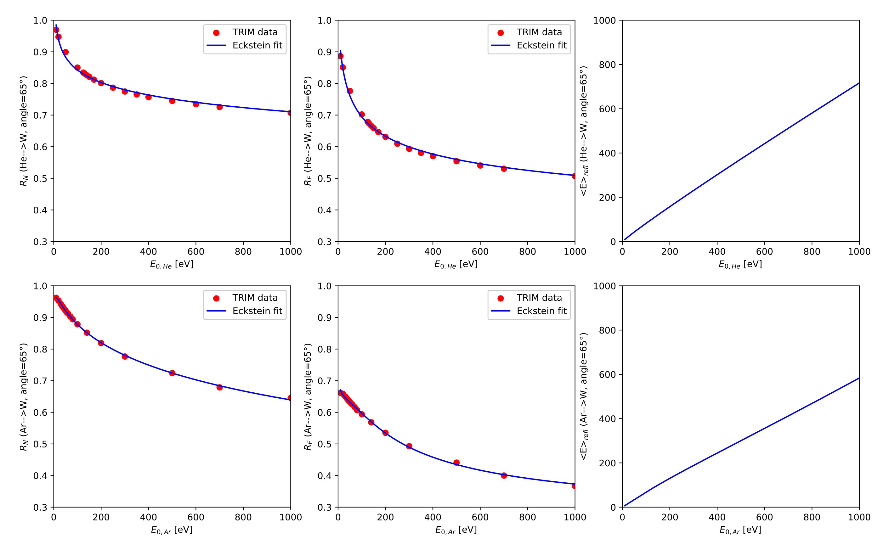
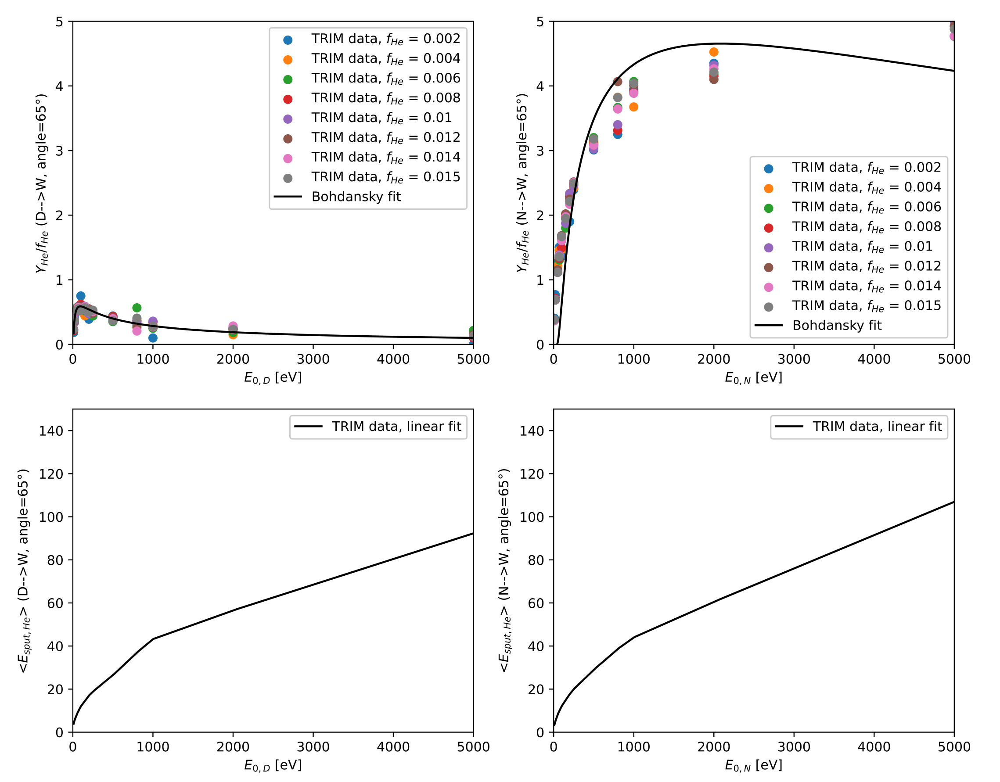
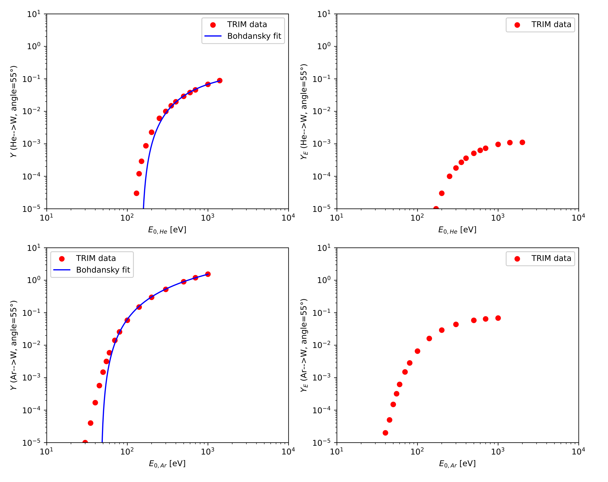

Surface data
============

Here we provide a basic description of types of plasma-surface interactions included in Aurora, as well of the organization of surface data. In this framework, particles arriving from the outside towards a surface are called `projectiles`, and the surface itself is called `target`.

If a projectile penetrates a solid target it will undergo several scattering events due to elastic collision with the target lattice atoms, leading to energy loss and change of direction of motion. If the projectile loses all its energy while still into the solid, it gets deposited somewhere in the solid, in a process called `implantation`. Alternatively, if after some collisions the scattering direction brings it outside the target again, it will leave the solid while being still energetic, in a process called `reflection`.

The elastic energy lost by a projectile in a collision, additionally, is transferred to the target atoms, which recoil and can themselves collide with other target atoms, generating a collision cascade. Target atoms may also acquire sufficient kinetic energy to escape from the solid, in a process called `sputtering`. Atoms removed from the surface may belong to the target material itself (in this we refer to `bulk sputtering`), or to foreign impurity atoms which had been previously implanted into the material (in this case we refer to `impurity sputtering`). 

All the plasma-surface interaction data used in Aurora were generated by the Monte Carlo program trim.sp, which simulates the interaction of energetic ions with solid surfaces according to a binary collision approximation. trim.sp uses a quantum mechanical treatment of ion-atom binary interactions, including kinetimatic collisions and Coulomb screening, and considers randomizes target structures with a nearly flat surface, in which a statistically roughness of the order of one monolayer is taken into account. For details please refer to J.P. Biersack and W. Eckstein, `Appl. Phys. A` 34, 73-94 (1984) and W. Eckstein, `Radiat. Eff. Defects Solids` 130-131, 239-250 (1994). The data contained in the datafiles provided with Aurora for implantation ranges, reflection and bulk sputtering were originally published in W. Eckstein, IPP-Report 9/132, Garching, 2002, while the data regarding impurity sputtering were generated by K. Schmid (IPP-MPI).

The :py:func:`~aurora.trim_files.trim_files_dict` function gives a dictionary of recommended files that users can adopt. The extension of the file determine the type of data which the files contain. A number of functions is available in the :py:mod:`~aurora.surface` module to read, fit and plot the surface data.

Note that, while all tabular TRIM-procuced data files are coupled with a corresponding file containing the manually calculated parameters for the corresponding fitting curves, the fit might be not correct yet for all the data. The user is encouraged to manually check the quality of the fit, plotting the surface data which they intend to use, prior to usage.

Reflection data
---------------

Reflection data are contained in files with extensions `rn`, `re`.

The files named `[projectile]_[target].rn` contain the calculated `particle reflection coefficient` :math:`R_N`, defined as the fraction of incident projectile ions which are backscattered from the surface.

The files named `[projectile]_[target].re` contain the calculated `energy reflection coefficient` :math:`R_E`, defined in such a way that the mean energy of backscattered ions, for a constant energy :math:`E_0` of the incident ions, is :math:`\langle E_{\text{refl}} \rangle = E_0 \cdot (R_E / R_N)`.

The tables are arranged in such a way that rows give an angular dependence of reflection coefficients at a fixed energy :math:`E_0`, and columns give an energy dependence at a fixed angle of incidence. On top of the tables the values for the  atomic numbers (:math:`Z`) and the masses (:math:`m`) of the projectile (index 1) and the target atoms (index 2) and the value for the surface binding energy (:math:`E_s`) are given. Furthermore, the number `ne` of incident energies and the number `na` of incident angles at which the data are calculated are provided.

The files named `[projectile]_[target]_fit.rn` and `[projectile]_[target]_fit.re` contain, respectively, the parameters derived fitting the calculated reflection coefficients with the empirical Eckstein formula :math:`R_N(E_0) = \frac{\exp{(a_1 \epsilon^{a_2})}}{1+\exp{(a_3 \epsilon^{a_4})}}` and :math:`R_E(E_0) = \frac{\exp{(b_1 \epsilon^{b_2})}}{1+\exp{(b_3 \epsilon^{b_4})}}`, where :math:`E_0` is the projectile energy, and (:math:`a_1`, :math:`a_2`, :math:`a_3`, :math:`a_4`) and (:math:`b_1`, :math:`b_2`, :math:`b_3`, :math:`b_4`) are the fitting parameters for particle and energy reflection coefficients respectively, contained in the tables for each available value of the projectile incidence angle. :math:`\epsilon` is the reduced energy, defined as :math:`\epsilon = E_0 / E_{TF}`, where :math:`E_{TF} = \frac{Z_1 Z_2 e^2}{\alpha_L} \frac{m_1+m_2}{m_2}` is the Thomas-Fermi energy, in which :math:`Z_1`, :math:`Z_2` are the nuclear charges, and :math:`m_1`, :math:`m_2` are the masses of the projectile and target atoms respectively, and :math:`e` is the electron charge. Finally, :math:`\alpha_L`, defined as :math:`\alpha_L = 0.4685 (Z_1^{2/3}+Z_2^{2/3})^{-1/2}`, in angstrom, is the Lindhard screening length.

The currently available data include H, D, T, He, N, Ne, Ar as projectiles, and Be, C, W as targets (including self-bombardment).

The following example shows how to exctract and plot the original TRIM-calculated reflection data, as well as their empirical fit curves:

.. literalinclude:: ../examples/surface_data_reflection.py

    Particle reflection coefficients, energy reflection coefficients and mean reflected energy for different impurities (He, Ar) on the same surface material (W) in function of the projectile impact energy

Implantation depth data
-----------------------

Implantation depth data are contained in files with extensions `d`.

The files named `[projectile]_[target].d` contain the calculated `mean implantation depth` :math:`\lambda`, in angstrom, defined as the first moment of the depth distribution of implanted impurity into the solid.

The tables are arranged in such a way that rows give an angular dependence of implantation depths at a fixed energy :math:`E_0`, and columns give an energy dependence at a fixed angle of incidence. On top of the tables the values for the  atomic numbers (:math:`Z`) and the masses (:math:`m`) of the projectile (index 1) and the target atoms (index 2) and the value for the surface binding energy (:math:`E_s`) are given. Furthermore, the number `ne` of incident energies and the number `na` of incident angles at which the data are calculated are provided.

The currently available data include He as projectile, and Be, C, W as targets.

Impurity sputtering data
------------------------

.. warning::
    While the TRIM-calculated reflection and bulk sputtering data have been thoroughly benchmarked against dedicated experiments, the impurity sputtering data provided with Aurora are pure results of computer simulations, and have not been benchmarked against experiments yet.

Impurity sputtering data are contained in files with extensions `y`, `ye`.

The files named '[projectile]_[impurity]_[target].y' contain the calculated 'normalized sputtering yield', defined as the mean number of sputtered impurity atoms per unity of incident projectile ions, normalized to the impurity concentration in the material.

The files named '[projectile]_[impurity]_[target].ye' contain the calculated 'mean sputtering energy', defined as the mean energy at which the implanted impurity are released from the solid.

The tables regarding the sputtering yields are arranged in rows providing the sputtering yield of the implanted impurity (:math:`Y_{\text{imp}}`) in function of angle of incidence of the projectile, energy of the projectile and impurity concentration into the surface layer of material (:math:`C_{\text{imp}}`, defined as :math:`C_{\text{imp}} = N_{\text{imp}}/(N_{\text{bulk}}+N_{\text{imp}})`). On top of the tables the values for the atomic numbers (:math:`Z`) and the masses (:math:`m`) of the projectile (index 1) and the impurity target atoms (index 2) are given, as well as the depth of the assumed implantation profile.

The tables regarding the sputtering energies are arranged in rows containing the sputtering energy of the implanted impurity (:math:`\langle E_{\text{sput}} \rangle`) in function of energy of the projectile only, for now only for the most probable incidence angle.

The files named '[projectile]_[impurity]_[target]_fit.y' contain the coefficients derived fitting the calculated sputtering yield data with the Bohdansky formula :math:`\frac{Y_{\text{imp}}(E_0)}{C_{\text{imp}}} = Q S_n \left(1- \left( \frac{E_{th}}{E_0} \right) ^{2/3} \right)(1-\left(\frac{E_{th}}{E_0} \right))^2`, where :math:`E_0` is the projectile energy, and :math:`Q` and :math:`E_{th}` are the fitting parameters, contained in the tables for each available value of the projectile incidence angle. :math:`S_n` is the nuclear stopping cross section, defined as :math:`S_n = (0.5 \ln{(1+1.2288 \epsilon)})/(\epsilon+0.1728\sqrt{\epsilon}+0.008 \epsilon ^ {0.1504})`. :math:`\epsilon` is the reduced energy, defined as :math:`\epsilon = E_0 / E_{TF}`, where :math:`E_{TF} = \frac{Z_1 Z_2 e^2}{\alpha_L} \frac{m_1+m_2}{m_2}` is the Thomas-Fermi energy, in which :math:`Z_1`, :math:`Z_2` are the nuclear charges, and :math:`m_1`, :math:`m_2` are the masses of the projectile and target atoms respectively, and :math:`e` is the electron charge. Finally, :math:`\alpha_L`, defined as :math:`\alpha_L = 0.4685 (Z_1^{2/3}+Z_2^{2/3})^{-1/2}`, in angstrom, is the Lindhard screening length.

The increase of the calculated sputtering yield with the impurity concentration in the material is roughly linear,meaning that one single fit, giving :math:`Y_{\text{imp}}(E_0)/C_{\text{imp}}`.

The currently available data include D, He, B, N as projectiles, He as implanted impurity and W as target.

The following example shows how to exctract and plot the original TRIM-calculated impurity sputtering data, as well as their empirical fit curves:

.. literalinclude:: ../examples/surface_data_impurity_sputtering.py

    Normalized impurity sputtering yields and mean sputtered energy for the same impurity (He) implanted in the same surface material (W) by different projectiles (D, N), in function of the projectile impact energy

Bulk sputtering data
--------------------

Bulk sputtering data are contained in files with extensions `y`, `ye`.

The files named `[projectile]_[target].y` contain the calculated `sputtering yield` :math:`Y`, defined as the mean number of sputtered target atoms per unity of incident projectile ions.

The files named `[projectile]_[target].ye` contain the calculated `sputtering energy yield` :math:`Y_E`, defined in such a way that the mean energy of sputtered atoms, for a constant energy :math:`E_0` of the incident ions, is :math:`\langle E_{\text{sput}} \rangle = E_0 \cdot (Y_E / Y)`.

The tables are arranged in such a way that rows give an angular dependence of reflection coefficients at a fixed energy :math:`E_0`, and columns give an energy dependence at a fixed angle of incidence. On top of the tables the values for the  atomic numbers (:math:`Z`) and the masses (:math:`m`) of the projectile (index 1) and the target atoms (index 2) and the value for the surface binding energy (:math:`E_s`) are given. Furthermore, the number `ne` of incident energies and the number `na` of incident angles at which the data are calculated are provided.

The files named `[projectile]_[target]_fit.y` contain the coefficients derived fitting the calculated sputtering yield data with the Bohdansky formula :math:`Y(E_0) = Q S_n \left(1- \left( \frac{E_{th}}{E_0} \right) ^{2/3} \right)(1-\left(\frac{E_{th}}{E_0} \right))^2`, where :math:`E_0` os the projectile energy, and :math:`Q` and :math:`E_{th}` are the fitting parameters, contained in the tables for each available value of the projectile incidence angle. :math:`S_n` is the nuclear stopping cross section, defined as :math:`S_n = (0.5 \ln{(1+1.2288 \epsilon)})/(\epsilon+0.1728\sqrt{\epsilon}+0.008 \epsilon ^ {0.1504})`. :math:`\epsilon` is the reduced energy, defined as :math:`\epsilon = E_0 / E_{TF}`, where :math:`E_{TF} = \frac{Z_1 Z_2 e^2}{\alpha_L} \frac{m_1+m_2}{m_2}` is the Thomas-Fermi energy, in which :math:`Z_1`, :math:`Z_2` are the nuclear charges, and :math:`m_1`, :math:`m_2` are the masses of the projectile and target atoms respectively, and :math:`e` is the electron charge. Finally, :math:`\alpha_L`, defined as :math:`\alpha_L = 0.4685 (Z_1^{2/3}+Z_2^{2/3})^{-1/2}`, in angstrom, is the Lindhard screening length.

The currently available data include H, D, T, He, N, Ne, Ar as projectiles, and Be, C, W as targets (including self-bombardment).

The following example shows how to exctract and plot the original TRIM-calculated bulk sputtering data, as well as their empirical fit curves:

.. literalinclude:: ../examples/surface_data_bulk_sputtering.py

    Bulk sputtering yields and bulk energy sputtering yields for different impurities (He, Ar) on the same surface material (W) in function of the projectile impact energy
    