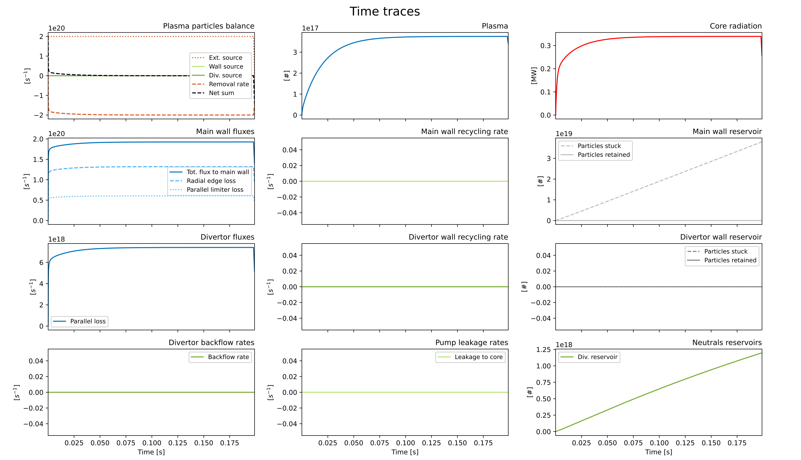
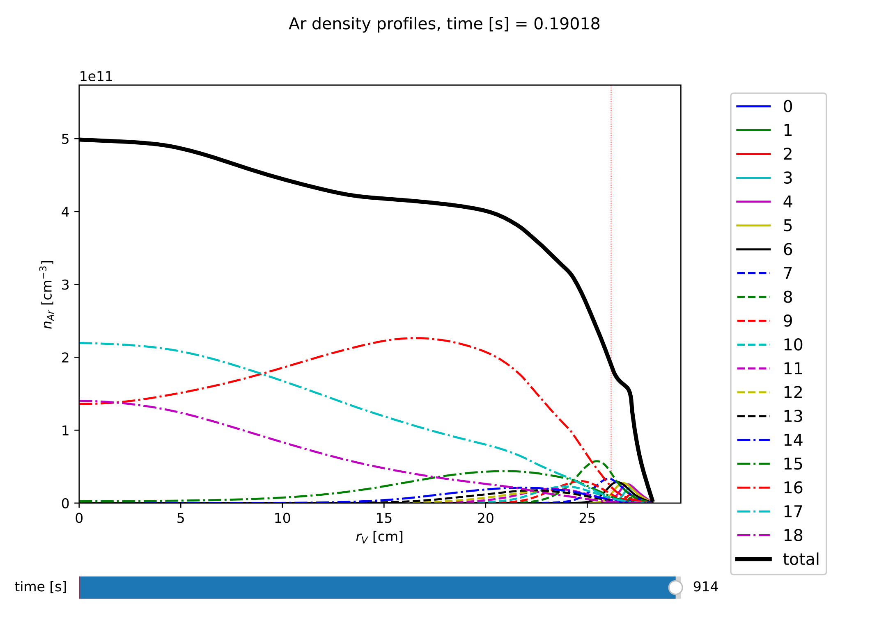
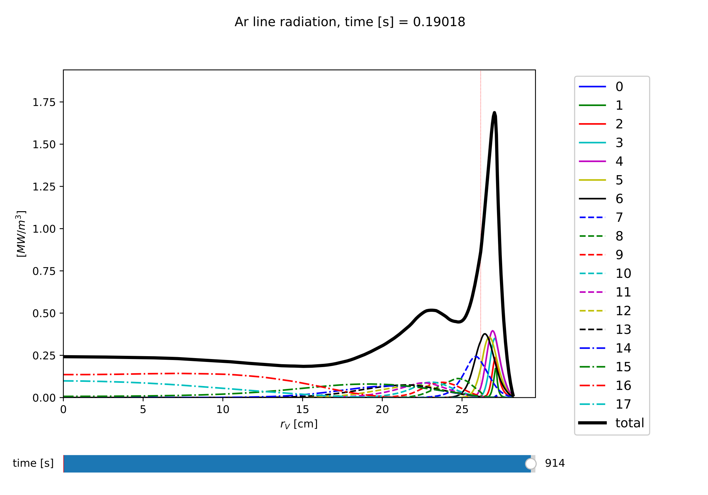
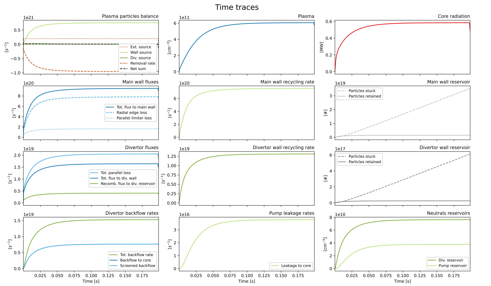
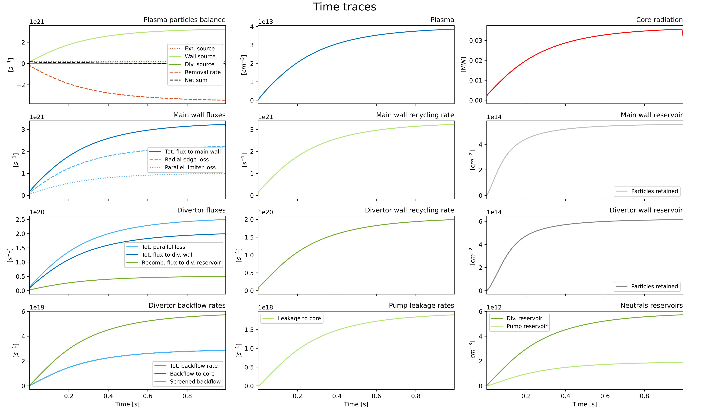
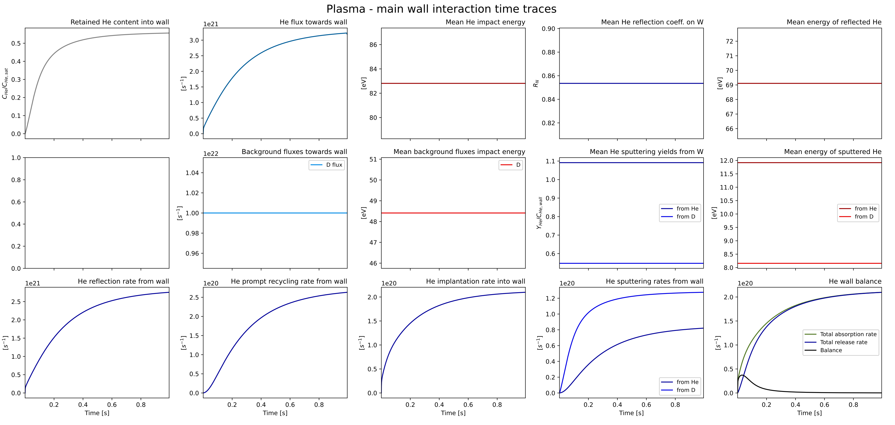
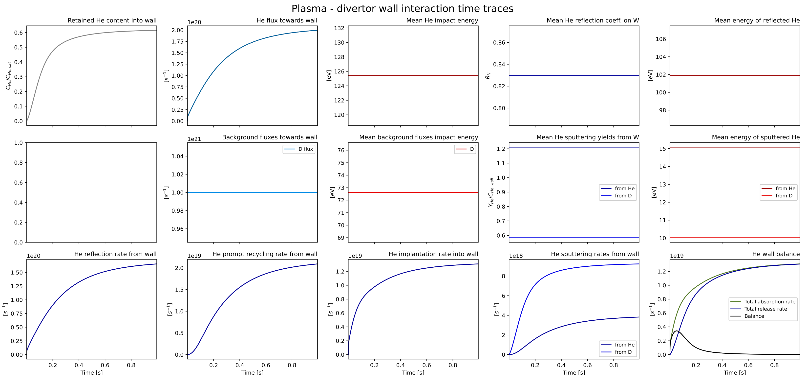
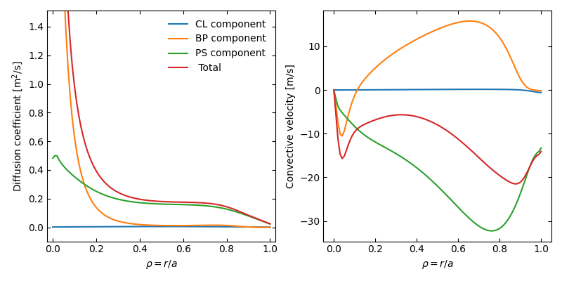

Tutorial
========

Assuming that you have Aurora already installed on your system, we're now ready to move forward. Some basic Aurora functionality is demonstrated in the `examples` package directory, where users may find a number of useful scripts. Here, we go through some of the same examples and methods.

Preparing Aurora simulations
----------------------------

If Aurora is correctly installed, you should be able to do::

  import aurora
  
Let's also import some other Python package that we will need::

  import numpy as np
  import matplotlib.pyplot as plt
  
Now let's load a the Aurora namelist containing the default input parameters::

  namelist = aurora.load_default_namelist()

Note that you can always look at where this and other functions are defined in the package by using, e.g.::

  aurora.load_default_namelist.__module__

Once you have loaded the default namelist, have a look at the `namelist` dictionary. It contains a number of parameters that are needed for Aurora runs. See the section :ref:`params` for a complete list of such parameters.

Some of them, like the name of the device, are only important if automatic fetching of the EFIT equilibrium through `MDSplus` is required, or else it can be ignored (leaving it to its default value). Most of the parameter names should be fairly self-descriptive.

Aurora leverages the `omfit_classes` package to interface with MDS+, EFIT, and a number of other codes. Thanks to this, users can focus more on their applications of interest, and less on re-inventing the wheel to write code that the OMFIT Team has kindly made public! To follow the rest of this tutorial, do::

  from omfit_classes import omfit_eqdsk, omfit_gapy

Next, we read in a magnetic equilibrium. You can find an example from a C-Mod discharge in the `examples` directory::
  
  geqdsk = omfit_eqdsk.OMFITgeqdsk('example.gfile')

The output `geqdsk` dictionary contains the contents of the EFIT geqdsk file, with additional processing done by the `omfit_classes` package for flux surfaces. Only some of the dictionary fields are used; refer to the :py:mod:`~aurora.grids_utils` methods for details. The `geqdsk` dictionary is used to create a mapping between the `rhop` grid (square root of normalized poloidal flux) and a `rvol` grid, defined by the normalized volume of each flux surface. Aurora, like STRAHL, runs its simulations on the `rvol` grid. 

We next need to read in some kinetic profiles, for example from an `input.gacode` file (available in the `examples` directory)::
  
  inputgacode = omfit_gapy.OMFITgacode('example.input.gacode')

Other file formats (e.g. plasma statefiles, TRANSP outputs, etc.) may also be read with `omfit_gapy` or other OMFIT-distributed packages. It is however not important to Aurora how the users get kinetic profiles: all that matters is that they are stored in the `namelist['kin_prof']` dictionary. To set up time-independent kinetic profiles we can use::

  kp = namelist['kin_profs']
  kp['Te']['rhop'] = kp['ne']['rhop'] = np.sqrt(inputgacode['polflux']/inputgacode['polflux'][-1])
  kp['ne']['vals'] = inputgacode['ne']*1e13    # 1e19 m^-3 --> cm^-3
  kp['Te']['vals'] = inputgacode['Te']*1e3     # keV --> eV

Note that both electron density (`ne`) and temperature (`Te`) must be saved on a `rhop` grid. This grid is internally used by Aurora to map to the `rvol` grid. Also note that, unless otherwise stated, Aurora inputs are always in CGS units, i.e. all spatial quantities are given in :math:`cm`!! (the extra exclamation mark is there for a good reason...).

Next, we specify the ion species that we want to simulate, as well as the main ion species. We can simply do::

  imp = namelist['imp'] = 'Ar'
  namelist["main_element"] = "D"

and Aurora will internally find ADAS data for that ion (assuming that this is one of the common ones for fusion modeling).

Let's set the duration of the simulation to 0.2 s::

  namelist["timing"]["times"] = [0,0.2]

Let's also select a simple constant source of particles (starting at t=0) of :math:`2\cdot 10^{20}` particles/second::

  namelist['source_type'] = 'const'
  namelist['source_rate'] = 2e20

Assuming that we're happy with all the inputs in the namelist at this point (many more could be changed!), we can now go ahead and set up our Aurora simulation, using the input parameters contained in `namelist` and the magnetic equilibrium contained in `geqdsk`::

  asim = aurora.aurora_sim(namelist, geqdsk=geqdsk)

The :py:class:`~aurora.core.aurora_sim` class creates a Python object with spatial and temporal grids, kinetic profiles, atomic rates and all other inputs to the forward model. For example, it contains, as attributes, the time grid (`asim.time_grid`), the radial grid in different coordinates (`asim.rvol_grid`, `asim.rhop_grid`) and many more else.

Running Aurora simulations
--------------------------

Finally, let's impose some transport coefficients and run a simulation.

Aurora uses a diffusive-convective model for particle fluxes, so we need to specify diffusion (D) and convection (v) coefficients. Let's impose, for example, constant profiles over the entire radial grid::

  D_z = 1e4 * np.ones(len(asim.rvol_grid))
  V_z = -2e2 * np.ones(len(asim.rvol_grid))

In general (and very often in practice), D and v could be defined with more dimensions to include a time-dependence and also different values for different charge states.

At this point, we are ready to run an Aurora simulation, with::

  out = asim.run_aurora(D_z, V_z, plot=True)

Blazing fast! Depending on how many time and radial points you have requested (a few hundreds by default), how many charge states you are simulating, etc., a simulation could take as little as <50 ms, which is significantly faster than other codes, as far as we know. If you add `use_julia=True` to the :py:meth:`aurora.core.run_aurora` call the run will be even faster; wear your seatbelt!

Having selected `plot = True`, some plots of the results will be automatically shown. First of all, we have a table with the time traces of the particle content in the various reservoirs, the main fluxes between these, etc.:

    Time traces from the multi-reservoir particle balance model

* In the first row, we have a global balance for the plasma, including the fluxes of particles entering the plasma (through external sources and recycling) and the removel rate. If the net sum is zero, it means that the simulation has reached convergence. Additionally, we also have the total number of particles contained in the plasma, and the total line radiation emitted by the simulated impurity.

* In the second row, we have some time traces regarding the interaction between plasma and main wall. In particular, we have the total impurity flux towards the wall (through radial flux and parallel limiter loss in the SOL), the recycling rate from this, and the total number of particles stuck and retained in it.

* In the third row, we have some time traces regarding the interaction between plasma and divertor wall. In particular, we have the total impurity flux towards the wall (through parallel divertor loss in the SOL), the recycling rate from this, and the total number of particles stuck and retained in it.

* In the fourth row, we have some time traces regarding the neutral reservoirs, namely the backflow rate from the divertor reservoir towards the plasma, the leakage rate from the pump reservoir towards the plasma (if used), and the dynamic content of the employed neutrals reservoirs.

Then, we will also have a slider plot with which we can conveniently explore all the simulated charge state densities at all time steps:

    Simulated charge state density profiles

Use the slider to go over time, as you look at the distributions over radius of all the charge states. It would be really great if you could just save this type of time- and spatially-dependent visualization to a video-format, right? That couldn't be easier, using the :py:func:`~aurora.animate.animate_aurora` function::

  aurora.animate_aurora(asim.rhop_grid, asim.time_out, nz.transpose(1,0,2),
                        xlabel=r'$\rho_p$', ylabel='t={:.4f} [s]', zlabel=r'$n_z$ [A.U.]',
                        labels=[str(i) for i in np.arange(0,nz.shape[1])],
                        plot_sum=True, save_filename='aurora_anim')

After running this, a .mp4 file with the name "aurora_anim.mp4" will be saved locally.
    
The main output object of the simulation is the dictionary `out`. This fields contained in `out` are:

* `nz` (r, z, t): impurity density for all charge states in the plasma over time [1/cm^3].

* `N_mainwall` (t): number of impurity particles permanently stuck at the main wall over time [1/cm].

* `N_divwall` (t):  number of impurity particles permanently stuck at the divertor wall over time [1/cm].

* `N_div` (t):  number of impurity particles within the divertor reservoir over time [1/cm].

* `N_pump` (t):  number of impurity particles within the pump reservoir over time [1/cm].

* `N_out` (t):  number of impurity particles permanently removed through pumping over time [1/cm].

* `N_mainret` (t): number of impurity particles temporarily retained at the main wall over time [1/cm].

* `N_divret` (t): number of impurity particles temporarily retained at the divertor wall over time [1/cm].

* `N_tsu` (t): radial impurity flux towards main wall over time [1/cm/s].

* `N_dsu` (t): parallel impurity flux towards divertor wall over time [1/cm/s].

* `N_dsul` (t): parallel impurity flux towards limiter over time [1/cm/s].

* `rcld_rate` (t): total recycling flux from divertor wall over time [1/cm/s].

* `rcld_refl_rate` (t): reflected flux from divertor wall over time [1/cm/s].

* `rcld_recl_rate` (t): promptly recycled flux from divertor wall over time [1/cm/s].

* `rcld_impl_rate` (t): implanted flux into divertor wall over time [1/cm/s].

* `rcld_sput_rate` (1+background_species, t): sputtered fluxes from divertor wall over time [1/cm/s].

* `rclb_rate` (t): backflow from divertor reservoir towards the plasma over time [1/cm/s].

* `rcls_rate` (t): backflow from divertor reservoir which is screened from the plasma over time [1/cm/s].

* `rclp_rate` (t): leakage from pump reservoir towards the plasma over time [1/cm/s].

* `rclw_rate` (t): total recycling flux from main wall over time [1/cm/s].

* `rclw_refl_rate` (t): reflected flux from main wall over time [1/cm/s].

* `rclw_recl_rate` (t): promptly recycled flux from main wall over time [1/cm/s].

* `rclw_impl_rate` (t): implanted flux into main wall over time [1/cm/s].

* `rclw_sput_rate` (1+background_species, t): sputtered fluxes from main wall over time [1/cm/s].

Note that absolute numbers and fluxes are expressed as "per unit of length", since the multi-reservoir model is 0D.

If we want to extract e.g. only the simulated impurity density, we can do that with::

  nz = out['nz']

Finally, all the time traces concerning the multi-reservoir model might be also extracted in a dictionary `reservoirs` through::

  reservoirs = asim.reservoirs_time_traces(plot = False)

The names of the various fields in `reservoirs` should be self-explanatory.

Radiation predictions
---------------------

Once a set of charge state densities has been obtained, it is simple to compute radiation terms in Aurora. For example, using the results from the Aurora run in :ref:`Running Aurora simulations`, one can then run::

  asim.rad = aurora.compute_rad(imp, nz.transpose(2,1,0), asim.ne, asim.Te, prad_flag=True)

The documentation on :py:func:`~aurora.radiation.compute_rad` gives details on input array dimensions and various flags that may be turned on. In the case above, we simply indicated the ion number (`imp`), and provided charge state densities (with dimensions of time, charge state and space), electron density and temperature (dimensions of time and space). We then explicitely indicated `prad_flag=True`, which means that unfiltered "effective" radiation terms (line radiation and continuum radiation) should be computed. Bremsstrahlung is also estimated using an interpolation formula that is independent of ADAS data and can be found in `asim.rad['brems']`. However, note that bremsstrahlung is already included in `asim.rad['cont_rad']`, which also includes other terms including continuum recombination using ADAS data. It can be useful to compare the bremsstrahlung calculation in `asim.rad['brems']` with `asim.rad['cont_rad']`, but we recommend that users rely on the full continuum prediction for total power estimations.

Other possible flags of the :py:func:`~aurora.radiation.compute_rad` function include:

* `sxr_flag`: if True, compute line and continuum radiation in the SXR range using the ADAS "pls" and "prs" files. Bremsstrahlung is also separately computed using the ADAS "pbs" files.

* `thermal_cx_rad_flag`: if True, the code checks for inputs `n0` (atomic H/D/T neutral density) and `Ti` (ion temperature) and computes line power due to charge transfer from thermal background neutrals and impurities.

* `spectral_brem_flag`: if True, use the ADAS "brs" files to compute bremsstrahlung at a wavelength specified by the chosen file. 
     
All of the radiation flags are `False` by default.

ADAS files for all calculations are taken by default from the list of files indicated in :py:func:`~aurora.adas_files.adas_files_dict` function, but may be replaced by specifying the `adas_files` dictionary argument to :py:func:`~aurora.radiation.compute_rad`.

Results from :py:func:`~aurora.radiation.compute_rad` are collected in a dictionary (named "rad" above and added as an attribute to the "asim" object, for convenience) with clear keys, described in the function documentation.

To get a quick plot of the radiation profiles, e.g. for line radiation from all simulated charge states, one can do::

  aurora.slider_plot(asim.rvol_grid, asim.time_out, asim.rad['line_rad'].transpose(1,2,0),
                     xlabel=r'$r_V$ [cm]', ylabel='time [s]', zlabel='Total radiation [A.U.]',
                     labels=[str(i) for i in np.arange(0,nz.shape[1])],
                     plot_sum=True, x_line=asim.rvol_lcfs)

    Simulated line radiation profiles

Radiation profiles might be also plotted automatically, with all the default options in :py:func:`~aurora.radiation.compute_rad`, selecting the optional argument `plot_radiation = True` in the main run_aurora command.

Aurora's radiation modeling capabilities may also be useful when assessing total power radiation for integrated modeling. The :py:func:`~aurora.radiation.radiation_model` function allows one to easily obtain the most important radiation terms at a single time slice, both as power densities (units of :math:`MW/cm^{-3}`) and absolute power (units of :math:`MW`). To obtain the latter form, we need to integrate over flux surface volumes. To do so, we make use of the `geqdsk` dictionary obtained via::

  geqdsk = omfit_eqdsk.OMFITgeqdsk('example.gfile')

We then pass that to :py:func:`~aurora.radiation.radiation_model`, together with the impurity atomic symbol (`imp`), the `rhop` grid array, electron density (`ne_cm3`) and temperature (`Te_eV`), and optionally also background neutral densities to include thermal charge exchange::

  res = aurora.radiation_model(imp,rhop,ne_cm3,Te_eV, geqdsk,
                               n0_cm3=None, frac=0.005, plot=True)

Here we specified the impurity densities as a simple fraction of the electron density profile, by specifying the `frac` argument. This is obviously a simplifying assumption, effectively stating that the total impurity density profile should have a maximum amplitude of `frac` (in the case above, set to 0.005) and a profile shape (corresponding to a profile of `V/D`) that is identical to the one of the :math:`n_e` profile. This may be convenient for parameter scans in the design process of future devices, but is by no means a correct assumption. If we'd rather calculate the total radiated power from a specific set of impurity charge state profiles (e.g. from an Aurora simulation), we can do::

  res = aurora.radiation_model(imp,rhop,ne_cm3,Te_eV, geqdsk,
                               n0_cm3=None, nz_cm3=nz_cm3, plot=True)

where we specified the charge state densities (dimensions of space, charge state) at a single time. Since we specified `plot=True`, a number of useful radiation profiles should be displayed.

Of course, one can also estimate radiation from the main ions. To do this, we first want to estimate the main ion density, using::

  ni_cm3 = aurora.get_main_ion_dens(ne_cm3, ions)

with `ions` being a dictionary of the form::

  ions = {'C': nC_cm3, 'Ne': nNe_cm3}   # (time,charge state,space)

with a number of impurity charge state densities with dimensions of (time,charge state,space). The :py:func:`~aurora.radiation.get_main_ion_dens` function subtracts each of these densities (times the Z of each charge state) from the electron density to obtain a main ion density estimate based on quasineutrality. Before we move forward, we need to add a neutral stage density for the main ion species, e.g. using::

  niz_cm3 = np.vstack((n0_cm3[None,:],ni_cm3)).T

such that the `niz_cm3` output is a 2D array of dimensions (charge states, radii). 

To estimate main ion radiation we can now do::
  
  res_mainion = aurora.radiation_model('H',rhop,ne_cm3,Te_eV, vol, nz_cm3 = niz_cm3, plot=True)

(Note that the atomic data does not discriminate between hydrogen isotopes).
In the call above, the neutral density has been included in `niz_cm3`, but note that (1) there is no radiation due to charge exchange between deuterium neutrals and deuterium ions, since they are indistinguishable, and (2) we did not attempt to include the effect of charge exchange on deuterium fractional abundances because `n0_cm3` (included in `niz_cm3` already fully specifies fractional abundances for main ions).

Zeff contributions
------------------

Following an Aurora run, one may be interested in what is the contribution of the simulated impurity to the total effective charge of the plasma. The :py:meth:`~aurora.core.aurora_sim.calc_Zeff` method allows one to quickly compute this by running::

  asim.calc_Zeff()

This makes use of the electron density profiles (as a function of space and time), stored in the "asim" object, and keeps Zeff contributions separate for each charge state. They can of course be plotted with :py:func:`~aurora.plot_tools.slider_plot`::

  aurora.slider_plot(asim.rvol_grid, asim.time_out, asim.delta_Zeff.transpose(1,0,2),
                     xlabel=r'$r_V$ [cm]', ylabel='time [s]', zlabel=r'$\Delta$ $Z_{eff}$',
                     labels=[str(i) for i in np.arange(0,nz.shape[1])],
                     plot_sum=True,x_line=asim.rvol_lcfs)

You should get something that looks like this:

.. figure:: figs/aurora_Zeff_example.jpeg
    :align: center
    :alt: Example of Z-effective contributions at the end of an Aurora Ar simulation
    :figclass: align-center

    Example of Z-effective contributions at the end of an Aurora Ar simulation

Ionization equilibrium
----------------------

It may be useful to compare and contrast the charge state distributions obtained from an Aurora run with the distributions predicted by pure ionization equilibium, i.e. by atomic physics only, with no trasport. To do this, we only need some kinetic profiles, which for this example we will load from the sample `input.gacode` file available in the "examples" directory::

  import omfit_gapy
  inputgacode = omfit_gapy.OMFITgacode('example.input.gacode')

Recall that Aurora generally uses CGS units, so we need to convert electron densities to :math:`cm^{-3}` and electron temperatures to :math:`eV`::

  rhop = np.sqrt(inputgacode['polflux']/inputgacode['polflux'][-1])
  ne_vals = inputgacode['ne']*1e13 # 1e19 m^-3 --> cm^-3
  Te_vals = inputgacode['Te']*1e3  # keV --> eV

Here we also defined a `rhop` grid from the poloidal flux values in the `inputgacode` dictionary. We can then use the :py:func:`~aurora.atomic.get_atom_data` function to read atomic effective ionization ("scd") and recombination ("acd") from the default ADAS files listed in :py:func:`~aurora.adas_files.adas_files_dict`. In this example, we are going to focus on calcium ions::

  atom_data = aurora.get_atom_data('Ca',['scd','acd'])

In ionization equilibrium, all ionization and recombination processes will be perfectly balanced. This condition corresponds to specific fractions of each charge state at some locations that we define using arrays of electron density and temperature. We can compute fractional abundances and plot results using::

  Te, fz = aurora.get_frac_abundances(atom_data, ne_vals, Te_vals, rho=rhop, plot=True)

The :py:func:`~aurora.atomic.get_frac_abundances` function returns the log-10 of the electron temperature on the same grid as the fractional abundances, given by the `fz` parameter (dimensions: space, charge state). This same function can be used to both compute radiation profiles of fractional abundances or to compute fractional abundances as a function of scanned parameters `ne` and/or `Te`. An additional argument of `ne_tau` (units of :math:`m^{-3}\cdot s`) can be used to approximately model the effect of transport on ionization balance.

.. figure:: figs/W_Ca_frac_abundances_superstaging_new.jpg
    :width: 500
    :align: center
    :alt: Ionization equilibria of W and Ca (dashed lines), also showing some choices of charge state bundling (superstaging) for both species.
    :figclass: align-center

    Ionization equilibria of W and Ca (dashed lines), also showing some choices of charge state bundling (superstaging) for both species.

The figure above shows examples of ionization equilibria for W and Ca as a function of electron temperature. Dashed lines here show the complete/standard result, whereas the continuous lines show examples of charge state bundling (superstaging), using arbitrarily-chosen partitions. Superstaging is an extremely useful and interesting technique to reduce the computational complexity of medium- and high-Z ions, since often the cost of simulations scales linearly (as in Aurora), or worse, with the number of charge states (Z). You can read more about superstaging in the paper `F Sciortino et al 2021 Plasma Phys. Control. Fusion 63 112001 <https://iopscience.iop.org/article/10.1088/1361-6587/ac2890>`_.

Extending the multi-reservoir particle balance model
----------------------------------------------------

So far we have been working with most of the input parameters set to their default value. Let's try now to adapt some parameters in order to extend the employed recycling options and fully exploit Aurora's multi-reservoir particle balance.

We start by setting the some input parameters as in the previous tutorial::

  import aurora
  
  import numpy as np
  import matplotlib.pyplot as plt
  
  namelist = aurora.load_default_namelist()
  
  from omfit_classes import omfit_eqdsk, omfit_gapy

  geqdsk = omfit_eqdsk.OMFITgeqdsk('example.gfile')
  
  inputgacode = omfit_gapy.OMFITgacode('example.input.gacode')

  kp = namelist['kin_profs']
  kp['Te']['rhop'] = kp['ne']['rhop'] = np.sqrt(inputgacode['polflux']/inputgacode['polflux'][-1])
  kp['ne']['vals'] = inputgacode['ne']*1e13    # 1e19 m^-3 --> cm^-3
  kp['Te']['vals'] = inputgacode['Te']*1e3     # keV --> eV
  
  imp = namelist['imp'] = 'Ar'
  namelist["main_element"] = "D"

  namelist["timing"]["times"] = [0,0.2]

  namelist["source_type"] = "const"
  namelist["source_rate"] = 2e20  # particles/s

Let's activate now recycling, i.e. we allow particles from the walls and from the neutrals reservoirs to return back to the plasma, which is a more realistic representation of the behavior of an actual tokamak discharge::

  namelist['recycling_flag'] = True

For this, we need to set a recycling coefficient and a recycling time for the walls::

  namelist['wall_recycling'] = 0.8
  namelist['tau_rcl_ret_ms'] = 2.0  # ms

and a retention time for the divertor neutrals reservoir, i.e. the time scale for the backflow from the divertor reservoir towards the plasma::

  namelist['tau_div_SOL_ms'] = 2.0  # ms

We can also set more parameters for edge/divertor transport. For example, we can select the fraction of the parallel impurity flux towards the divertor which recombines before reaching the divertor wall, and the screening efficiency of the backflow from the divertor reservoir towards the plasma:::

  namelist['div_recomb_ratio'] = 0.2
  namelist['screening_eff'] = 0.5

Finally, let's select also realistic parameters for the pumping model. Aurora allows to impose a physical volume for the divertor neutrals reservoir, through::

  namelist['phys_volumes'] = True
  namelist['vol_div'] = 0.4e6  # cm^3

We can also specify a pumping which takes place not from the divertor reservoir, but from a second "pump" reservoir connected to the divertor (whose volume must be also specified), through::

  namelist['pump_chamber'] = True
  namelist['vol_pump'] = 1.0e6  # cm^3

Neutral transport and pumping must be finally specified through the following parameters::

  namelist['L_divpump'] = 0.5e8  # cm^3/s, transport conductance from divertor reservoir to pump reservoir
  namelist['L_leak'] = 0.5e8  # cm^3/s, leakage conductance from pump reservoir towards plasma
  namelist['S_pump'] = 5.0e7  # cm^3/s, engineering pumping speed applied to the pump reservoir, for permanent particle removal

We can now go ahead and set up our Aurora simulation, using the input parameters contained in `namelist` and the magnetic equilibrium contained in `geqdsk`: ::

  asim = aurora.aurora_sim(namelist, geqdsk=geqdsk)

Again, let's impose some constant transport coefficients::

  D_z = 1e4 * np.ones(len(asim.rvol_grid))
  V_z = -2e2 * np.ones(len(asim.rvol_grid))

and finally let's run the simulation::

  out = asim.run_aurora(D_z, v_z, plot=True)

Looking at the time traces, we will see several new plots being filled, corresponding to the new non-default options we used.

    Time traces from the extended multi-reservoir particle balance model

* Having activated wall recycling, we will have a fraction of particles striking the wall being permanently stuck, and the remaning fraction being only temporarily retained, i.e. being later released and producing recycling fluxes.

* Having imposed a recombination ratio < 1.0 in the the divertor, a fraction of the parallel SOL flux will also interact with the divertor wall instead of directly entering the divertor neutrals reservoir. The behavior of the divertor wall is exactly the same as the main wall: however, while particles recycling from the main wall will constitute a new source for the plasma, particle recycling from the divertor wall will fill the divertor neutrals reservoir.

* Having activated the recycling, a backflow from the divertor neutrals reservoir towards the plasma is allowed. However, having imposed a screening factor > 0.0 in the divertor, only a fraction of the flux lost from the divertor will effectively re-enter the plasma.

* Having assumed the presence of a second neutrals reservoir, i.e. the "pump" reservoir, before the actual pump, its content will be also shown, together with the content of the divertor neutrals reservoir. Additionally, having assumed a leakage conductance > 0.0 from the pump, also from this chamber there will be a flux of particles coming back to the plasma.

Note that, having defined actual volumes for the neutrals reservoirs, the particle content in these (rightmost plot in the bottom row) is automatically shown in terms of volumetric densities rather than in absolute number of particles. For consistency, the same is applied to the plasma (center plot in the first row), where volume-averaged density of plasma particles is shown.

Finally, all the time traces concerning the multi-reservoir model might be also extracted, as before, in a dictionary `reservoirs` through::

  reservoirs = asim.reservoirs_time_traces(plot = False)

Using the advanced plasma-wall interaction model
------------------------------------------------

Finally, let's try to couple the wall recyclng model in Aurora with the advanced plasma-wall interaction model, in which wall retention is simulated according to realistic reflection and sputtering coefficient and wall saturation densities and impact energy/angles of projectile ions.

.. note::
    The advanced PWI model is currently only supported for He as impurity and W as wall material, with several other species as projectiles (D, He, B, N). Coefficients for other impurity-wall material-projectile combinations might be, however, easily calculated and implemented. Please contact the code developers if you are interested in some other specific combination of impurity-wall material-projectile.

We start by setting the some input parameters as in the previous tutorial: ::

  import aurora
  
  import numpy as np
  import matplotlib.pyplot as plt
  
  namelist = aurora.load_default_namelist()
  
  from omfit_classes import omfit_eqdsk, omfit_gapy

  geqdsk = omfit_eqdsk.OMFITgeqdsk('example.gfile')
  
  inputgacode = omfit_gapy.OMFITgacode('example.input.gacode')

  kp = namelist['kin_profs']
  kp['Te']['rhop'] = kp['ne']['rhop'] = np.sqrt(inputgacode['polflux']/inputgacode['polflux'][-1])
  kp['ne']['vals'] = inputgacode['ne']*1e13    # 1e19 m^-3 --> cm^-3
  kp['Te']['vals'] = inputgacode['Te']*1e3     # keV --> eV
  
  imp = namelist['imp'] = 'He'
  namelist["main_element"] = "D"

  namelist["timing"]["times"] = [0,1.0]

  namelist["source_type"] = "const"
  namelist["source_rate"] = 2e20  # particles/s
  
Of course, the recycling needs to be activated: ::

  namelist['recycling_flag'] = True
  
Let's also activate some features regarding edge/divertor transport, and pumping: ::

  namelist['screening_eff'] = 0.5
  namelist['div_recomb_ratio'] = 0.2  # ms
  namelist['tau_div_SOL_ms'] = 40.0  # ms
  namelist['phys_volumes'] = True
  namelist['vol_div'] = 0.4e6  # cm^3
  namelist['pump_chamber'] = True
  namelist['vol_pump'] = 1.0e6  # cm^3
  namelist['L_divpump'] = 0.5e8 # cm^3/s 
  namelist['L_leak'] = 1.0e6 # cm^3/s
  namelist['S_pump'] = 1.0e8  # cm^3/s 
  
To properly account the number of particles stored in a wall material, we need to specify the surface areas of main and divertor walls which are in contact with the plasma (i.e. over which the impurity fluxes will strike): ::

  namelist['phys_surfaces'] = True
  namelist['surf_mainwall'] = 1.0e4 # cm^2
  namelist['surf_divwall'] = 1.0e3 # cm^2    

We will need now to specify some characteristics of both the walls. First of all, their bulk material: ::

  namelist['advanced_PWI']['main_wall_material'] = 'W'
  namelist['advanced_PWI']['div_wall_material'] = 'W'

Then, a "saturation value"2 of implanted impurity surface density: ::

  namelist['advanced_PWI']['n_main_wall_sat'] = 1e19  # m^-2
  namelist['advanced_PWI']['n_div_wall_sat'] = 1e19  # m^-2

and a "characteristic" impact energy of the simulated impurity onto the walls over the entire device lifetime, used by Aurora estimate the implantation depth of the impurity into the wall material: ::

  namelist['advanced_PWI']['characteristic_impact_energy_main_wall'] = 200 # eV
  namelist['advanced_PWI']['characteristic_impact_energy_div_wall'] = 500 # eV

The last two couples of parameters together will be used to calculate the absolute maximum number of impurity particles which the walls can accomodate as reservoirs.

Now, we should consider that, while the implantation of the impurity is only determined by the flux of the impurity itself hitting a wall surface (which is self-consistently simulated by Aurora), the successive through sputtering is determined by the bombardment of wall by not only the simulated impurity itself, but also by the main ion species in the background (and possibly other impurities present in the simulated experiment). Therefore, the user needs to manually specify the fluxes of all the other present "background species" towards the wall. We will need to do then: ::

  namelist['advanced_PWI']['background_mode'] = 'manual'
  namelist['advanced_PWI']['background_species'] = ['D']  # list of all background species
  namelist['advanced_PWI']['background_main_wall_fluxes'] = [1e22]  # s^-1, list of fluxes to main wall for all background species
  namelist['advanced_PWI']['background_div_wall_fluxes'] = [1e21]  # s^-1, list of fluxes to div. wall for all background species

For determing the coefficient it is also important to calculate the impact energy of the various projectiles onto the wall surface. This is calculated by Aurora specifying the electron temperature at the plasma-material interface: ::

  namelist['advanced_PWI']['Te_lim'] = 10.0 #  eV, main wall
  namelist['advanced_PWI']['Te_div'] = 15.0 #  eV, div. wall

Finally, let's also include the possibility of the recycled neutrals being re-emitted towards the plasma as energetic, with energies calculated from the plasma-material interaction coefficients: ::

  namelist['advanced_PWI']['energetic_recycled_neutrals'] = True

In order to properly activate the advanced PWI model, we do not call the main class :py:class:`~aurora.core.aurora_sim`, but the specifically adapted class :py:class:`~aurora.pwi.aurora_sim_pwi`::

  asim = aurora.pwi.aurora_sim_pwi(namelist, geqdsk=geqdsk)

Again, let's impose some constant transport coefficients::

  D_z = 1e4 * np.ones(len(asim.rvol_grid))
  V_z = -2e2 * np.ones(len(asim.rvol_grid))

and finally let's run the simulation::

  out = asim.run_aurora(D_z, v_z, plot=True, plot_PWI=True)
  
The time traces will be similar as before.

    Time traces from the extended multi-reservoir particle balance model with advanced PWI model
    
We note that now there is not an artificial distinction between particles "stuck" and "retained" at the walls. Additionally, having defined actual surface areas for the walls, the particles retained in these are automatically shown in terms of surface densities rather than in absolute number of particles.

Having also called the argument `plot_PWI=True`, a couple of new windows will show the various time time traces related to plasma-wall interaction, for both main and divertor walls:

    Plasma-wall interaction time traces for the main wall
    
    

    Plasma-wall interaction time traces for the divertor wall
    
* In the first row, we have the amount of impurity particles retained in the walls (but expressed now in terms of wall saturation level), the simulated impurity flux towards the wall, as well as the mean impact energy at which impurity particles collide with the wall. Finally we also have the calculated reflection coefficient for the simulated impurity from the wall, and the mean energy at which impurity particles are reflected.

* In the second row we have the manually imposed fluxes of all the other "background" species towards the wall, as well as their impact energy. Finally we have also the calculated sputtering yields for the implanted impurity from both the impurity itself as projectile, and from the other background species as projectiles, as well as the mean energy at which impurity particles are released by sputtering (in function of the projectile).

* Finally, in the third row we have the various interaction rates, namely: rate of reflected impurity particles, rate of promptly recycled impurity particles, rate of implanted impurity particles (i.e. absorbed by the wall), and rate of sputtered impurity particles by different projectiles (i.e. released by the wall). Rightmost, we have a global absorption/release balance for impurity particles from the wall as reservoir.

We note that, in this case, balance in the simulation (i.e. in turn a constant impurity content in the plasma) is determined by when fluxes into/out from the walls are balanced, i.e. absorption and release rate become equal.
  
Finally, similarly as it is done for `reservoirs`, the time traces concerning the plasma-wall interaction might be also extracted in a dictionary `PWI_traces` as::

  PWI_traces = asim.PWI_time_traces(plot = False)

The names of the various fields in `PWI_traces` should be self-explanatory.

Neoclassical transport with FACIT
---------------------------------

The FACIT model can be used in Aurora to calculate charge-dependent collisional transport coefficients analytically for the impurity species of interest. FACIT takes kinetic profiles and some magnetic geometry quantities (which shall be described shortly) as inputs, and outputs the collisional diffusion coefficient :math:`D_z` [:math:`m^2/s`] and convective velocity :math:`V_z` [:math:`m/s]` which can then be given as an input for :py:meth:`~aurora.core.aurora_sim.run_aurora`.

An example of a standalone call to FACIT is provided in `aurora/facit.py`, from which profiles of the transport coefficients are obtained: 

    Example of neoclassical W transport coefficients calculated with FACIT.

A complete description of the inputs and outputs of the model is provided in the documentation of the :py:class:`~aurora.facit.FACIT` class.

Note that FACIT provides the individual Pfirsch-Schüter, Banana-Plateau and classical collisional flux components, facilitating additional analysis of the physical processes involved in the transport.

An important feature of FACIT is the description of the effects of rotation on neoclassical transport across collisionality regimes, particularly relevant when heavy impurities like tungsten are analyzed. Rotation is described by the main ion Mach number :math:`M_i(r) = v_\varphi/v_{ti} = \Omega R_0/\sqrt{2 T_i/m_i}` and the `rotation_model` flag. These effects can typically be ignored for light impurities (from experience, the impact of rotation on Argon is small but potentially non-negligible).

.. warning::
   If `rotation_model=2`, then the flux surface contours :math:`R(r,\theta)`, :math:`Z(r,\theta)` that are inputs of FACIT should have a radial discretization equal to the `rho` coordinate in which FACIT will be evaluated. If they are not given as inputs, circular geometry will be assumed internally.

A full example on how to run FACIT in Aurora is given `examples/facit_basic.py`. The following code shows the initialization of the transport coefficients, the magnetic geometry and the main call to FACIT looped over each charge state of the impurity species:::

     times_DV = np.array([0])
     # note that to be able to give charge-dependent Dz and Vz,
     # one has to give also time dependence (see documentation of aurora.core.run_aurora()),
     # so a dummy time dimension with only one element is introduced here
     nz_init  = np.zeros((asim.rvol_grid.size, asim.Z_imp+1))
    
     D_z = np.zeros((asim.rvol_grid.size, times_DV.size, asim.Z_imp+1)) # space, time, nZ
     V_z = np.zeros(D_z.shape)

     # flux surface contours (when rotation_model = 2)
     RV, ZV = aurora.rhoTheta2RZ(geqdsk, rhop, theta, coord_in='rhop', n_line=201)
     RV, ZV = RV.T, ZV.T
   
     # call to FACIT for each charge state
     for j, tj in enumerate(times_DV):

         for i, zi in enumerate(range(asim.Z_imp + 1)):

             if zi != 0:
                 Nz     = nz_init[:idxsep+1,i]*1e6 # in 1/m**3
                 gradNz = np.gradient(Nz, roa*amin)

                 fct = aurora.FACIT(roa,
		                    zi, asim.A_imp,
				    asim.main_ion_Z, asim.main_ion_A,
				    Ti, Ni, Nz, Machi, Zeff,
				    gradTi, gradNi, gradNz,
				    amin/R0, B0, R0, qmag,
				    rotation_model = rotation_model, Te_Ti = TeovTi,
				    RV = RV, ZV = ZV)
            
		 D_z[:idxsep+1,j,i] = fct.Dz*100**2 # convert to cm**2/s
		 V_z[:idxsep+1,j,i] = fct.Vconv*100 # convert to cm/s

   
.. warning::
   FACIT uses lengths in :math:`[m]`, NOT :math:`[cm]`. In particular, input densities should be given in :math:`[m^{-3}]` and the output transport coefficients `Dz` and `Vconv` should be converted back from :math:`[m^2/s]` and :math:`[m/s]` to :math:`[cm^2/s]` and :math:`[cm/s]`, respectively, before passing them to :py:meth:`~aurora.core.aurora_sim.run_aurora`. 

In addition to the collisional transport coefficients calculated with FACIT, we can add a turbulent component to the total diffusion and convection, imposed by hand as in previous sections of this tutorial. In this example, we fix an approximate position for a pedestal top at :math:`\rho_{pol} \approx 0.9`, and assume that turbulence is suppresed inside the pedestal:::
  
  Dz_an = np.zeros(D_z.shape) # space, time, nZ
  Vz_an = np.zeros(D_z.shape)
  
  # estimate pedestal top position and find radial index of separatrix
  rped   = 0.90
  idxped = np.argmin(np.abs(rped - asim.rhop_grid))
  idxsep = np.argmin(np.abs(1.0 - asim.rhop_grid))
  
  # core turbulent transport coefficients
  Dz_an[:idxped,:,:] = 1e4  # cm^2/s
  Vz_an[:idxped,:,:] = -1e2 # cm/s
  
  # SOL transport coefficients
  Dz_an[idxsep:,:,:] = 1e4  # cm^2
  Vz_an[idxsep:,:,:] = -1e2 # cm/s
  
  D_z += Dz_an
  V_z += Vz_an

.. note::
   FACIT is distributed within Aurora. The following papers contain the derivation of the model:
   The self-consistent calculation of the Pfirsch-Schlüter flux and the poloidal asymmetries of heavy impurities at high collisionality is given in 
   `Maget et al 2020 Plasma Phys. Control. Fusion 62 105001 <https://iopscience.iop.org/article/10.1088/1361-6587/aba7f9>`_,
   `Maget et al 2022 Plasma Phys. Control. Fusion 64 069501 <https://iopscience.iop.org/article/10.1088/1361-6587/ac63e0>`_,
   while the extension to arbitrary collisionality and inclusion of the Banana-Plateau flux in the poloidally-symmetric (non-rotating) limit is obtained in
   `Fajardo et al 2022 Plasma Phys. Control. Fusion 64 055017 <https://iopscience.iop.org/article/10.1088/1361-6587/ac5b4d>`_,
   and finally the description of the effects of rotation across collisionality regimes is presented in
   `Fajardo et al 2023 Plasma Phys. Control. Fusion 65 <https://iopscience.iop.org/article/10.1088/1361-6587/acb0fc>`_.
