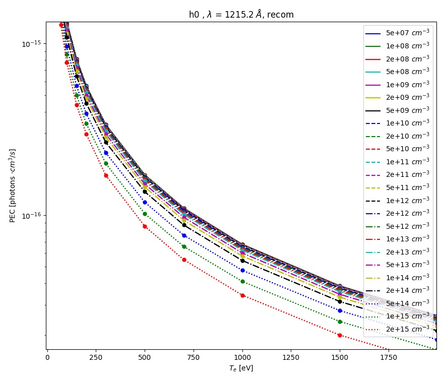

Tutorial
========

Assuming that you have Aurora already installed on your system, we're now ready to move forward. Some basic Aurora functionality is demonstrated in the `examples` package directory, where users may find a number of useful scripts. Here, we go through some of the same examples and methods.

Running Aurora simulations
--------------------------

If Aurora is correctly installed, you should be able to do::

  import aurora

and then load a default namelist for impurity transport forward modeling::

  namelist = aurora.load_default_namelist()

Note that you can always look at where this function is defined in the package by using, e.g.::

  aurora.load_default_namelist.__module__

Once you have loaded the default namelist, have a look at the `namelist` dictionary. It contains a number of parameters that are needed for Aurora runs. Some of them, like the name of the device, are only important if automatic fetching of the EFIT equilibrium through `MDSplus` is required, or else it can be ignored (leaving it to its default value). Most of the parameter names should be fairly self-descriptive. Please refer to docstrings throughout the code documentation.

Aurora leverages the `omfit_classes` package to interface with MDS+, EFIT, and a number of other codes. Thanks to this, users can focus more on their applications of interest, and less on re-inventing the wheel to write code that the OMFIT Team has kindly made public! To follow the rest of this tutorial, do::

  from omfit_classes import omfit_eqdsk, omfit_gapy

Next, we read in a magnetic equilibrium. You can find an example from a C-Mod discharge in the `examples` directory::
  
  geqdsk = omfit_eqdsk.OMFITgeqdsk('example.gfile')

The output `geqdsk` dictionary contains the contents of the EFIT geqdsk file, with additional processing done by the `omfit_classes` package for flux surfaces. Only some of the dictionary fields are used; refer to the :py:mod:`~aurora.grids_utils` methods for details. The `geqdsk` dictionary is used to create a mapping between the `rhop` grid (square root of normalized poloidal flux) and a `rvol` grid, defined by the normalized volume of each flux surface. Aurora, like STRAHL, runs its simulations on the `rvol` grid. 

We next need to read in some kinetic profiles, for example from an `input.gacode` file (available in the `examples` directory)::
  
  inputgacode = omfit_gapy.OMFITgacode('example.input.gacode')

Other file formats (e.g. plasma statefiles, TRANSP outputs, etc.) may also be read with `omfit_gapy` or other OMFIT-distributed packages. It is however not important to Aurora how the users get kinetic profiles: all that matters is that they are stored in the `namelist['kin_prof']` dictionary. To set up time-independent kinetic profiles we can use::

  kp = namelist['kin_profs']
  kp['Te']['rhop'] = kp['ne']['rhop'] = np.sqrt(inputgacode['polflux']/inputgacode['polflux'][-1])
  kp['ne']['vals'] = inputgacode['ne']*1e13    # 1e19 m^-3 --> cm^-3
  kp['Te']['vals'] = inputgacode['Te']*1e3     # keV --> eV

Note that both electron density (`ne`) and temperature (`Te`) must be saved on a `rhop` grid. This grid is internally used by Aurora to map to the `rvol` grid. Also note that, unless otherwise stated, Aurora inputs are always in CGS units, i.e. all spatial quantities are given in :math:`cm`!! (the extra exclamation mark is there for a good reason...).

Next, we specify the ion species that we want to simulate. We can simply do::

  imp = namelist['imp'] = 'Ar'

and Aurora will internally find ADAS data for that ion (assuming that this is one of the common ones for fusion modeling). The namelist also contains information on what kind of source of impurities we need to simulate; here we are going to select a constant source (starting at t=0) of :math:`10^{24}` particles/second.::

  namelist['source_type'] = 'const'
  namelist['source_rate'] = 1e24

Time dependent time histories of the impurity source may however be given by selecting `namelist['source_type']="step"` (for a series of step functions), `"synth_LBO"` (for an analytic function resembling a laser-blow-off (LBO) time history) or `"file"` (to load a detailed function from a file). Refer to the :py:meth:`~aurora.source_utils.get_source_time_history` method for more details. 

Assuming that we're happy with all the inputs in the namelist at this point (many more could be changed!), we can now go ahead and set up our Aurora simulation:::

  asim = aurora.aurora_sim(namelist, geqdsk=geqdsk)

The :py:class:`~aurora.core.aurora_sim` class creates a Python object with spatial and temporal grids, kinetic profiles, atomic rates and all other inputs to the forward model. Aurora uses a diffusive-convective model for particle fluxes, so we need to specify diffusion (D) and convection (V) coefficients next:::

  D_z = 1e4 * np.ones(len(asim.rvol_grid))  # cm^2/s
  V_z = -2e2 * np.ones(len(asim.rvol_grid)) # cm/s

Here we have made use of the `rvol_grid` attribute of the `asim` object, whose name is self-explanatory. This grid has a 1-to-1 correspondence with `asim.rhop_grid`. In the lines above we have created flat profiles of :math:`D=10^4 cm^2/s` and :math:`V=-2\times 10^2 cm/s`, defined on our simulation grids. D's and V's could in principle (and, very often, in practice) be defined with more dimensions to represent a time-dependence and also different values for different charge states. Unless specifed otherwise, Aurora assumes all points of the time grid (now stored in `asim.time_grid`) and all charge states to have the same D and V. See the :py:meth:`aurora.core.run_aurora` method for details on how to speficy further dependencies.

At this point, we are ready to run an Aurora simulation, with::

  out = asim.run_aurora(D_z, V_z)

Blazing fast! Depending on how many time and radial points you have requested (a few hundreds by default), how many charge states you are simulating, etc., a simulation could take as little as <50 ms, which is significantly faster than other code, as far as we know. If you add `use_julia=True` to the :py:meth:`aurora.core.run_aurora` call the run will be even faster; wear your seatbelt!

You can easily check the quality of particle conservation in the various reservoirs by using::

  reservoirs = asim.check_conservation()

which will show the results in full detail. The `reservoirs` output list contains information about how many particles are in the plasma, in the wall reservoir, in the pump, etc.. Refer to the :py:meth:`aurora.core.run_aurora` docstring for details. 

A plot is worth a thousand words, so let's make one for the charge state densities:::

  nz = out[0]  # charge state densities are stored first in the output of the run_aurora method
  aurora.slider_plot(asim.rvol_grid, asim.time_out, nz.t.transpose(1,0,2),
                     xlabel=r'$r_V$ [cm]', ylabel='time [s]', zlabel='Total radiation [A.U.]',
                     labels=[str(i) for i in np.arange(0,nz.shape[1])],
		     plot_sum=True, x_line=asim.rvol_lcfs )

You should get a slider showing a result like the following:

    Example of charge state density profiles at the end of an Aurora Ar simulation

    
Use the slider to go over time, as you look at the distributions over radius of all the charge states. It would be really great if you could just save this type of time- and spatially-dependent visualization to a video-format, right? That couldn't be easier, using the :py:func:`~aurora.animate.animate_aurora` function:::

  aurora.animate_aurora(asim.rhop_grid, asim.time_out, nz.transpose(1,0,2),
                        xlabel=r'$\rho_p$', ylabel='t={:.4f} [s]', zlabel=r'$n_z$ [A.U.]',
                        labels=[str(i) for i in np.arange(0,nz.shape[1])],
                        plot_sum=True, save_filename='aurora_anim')

After running this, a .mp4 file with the name "aurora_anim.mp4" will be saved locally.

Radiation predictions
---------------------

Once a set of charge state densities has been obtained, it is simple to compute radiation terms in Aurora. For example, using the results from the Aurora run in :ref:`Running Aurora simulations`, one can then run::

  asim.rad = aurora.compute_rad(imp, nz.transpose(2,1,0), asim.ne, asim.Te, prad_flag=True)

The documentation on :py:func:`~aurora.radiation.compute_rad` gives details on input array dimensions and various flags that may be turned on. In the case above, we simply indicated the ion number (`imp`), and provided charge state densities (with dimensions of time, charge state and space), electron density and temperature (dimensions of time and space). We then explicitely indicated `prad_flag=True`, which means that unfiltered "effective" radiation terms (line radiation and continuum radiation) should be computed. Bremsstrahlung is also estimated using an interpolation formula that is independent of ADAS data and can be found in `asim.rad['brems']`. However, note that bremsstrahlung is already included in `asim.rad['cont_rad']`, which also includes other terms including continuum recombination using ADAS data. It can be useful to compare the bremsstrahlung calculation in `asim.rad['brems']` with `asim.rad['cont_rad']`, but we recommend that users rely on the full continuum prediction for total power estimations.

Other possible flags of the :py:func:`~aurora.radiation.compute_rad` function include:

#. `sxr_flag`: if True, compute line and continuum radiation in the SXR range using the ADAS "pls" and "prs" files. Bremsstrahlung is also separately computed using the ADAS "pbs" files.

#. `thermal_cx_rad_flag`: if True, the code checks for inputs `n0` (atomic H/D/T neutral density) and `Ti` (ion temperature) and computes line power due to charge transfer from thermal background neutrals and impurities.

#. `spectral_brem_flag`: if True, use the ADAS "brs" files to compute bremsstrahlung at a wavelength specified by the chosen file. 
     
All of the radiation flags are `False` by default.

ADAS files for all calculations are taken by default from the list of files indicated in :py:func:`~aurora.adas_files.adas_files_dict` function, but may be replaced by specifying the `adas_files` dictionary argument to :py:func:`~aurora.radiation.compute_rad`.

Results from :py:func:`~aurora.radiation.compute_rad` are collected in a dictionary (named "rad" above and added as an attribute to the "asim" object, for convenience) with clear keys, described in the function documentation. To get a quick plot of the radiation profiles, e.g. for line radiation from all simulated charge states, one can do::

  aurora.slider_plot(asim.rvol_grid, asim.time_out, asim.rad['line_rad'].transpose(1,2,0),
                     xlabel=r'$r_V$ [cm]', ylabel='time [s]', zlabel='Total radiation [A.U.]',
                     labels=[str(i) for i in np.arange(0,nz.shape[1])],
                     plot_sum=True, x_line=asim.rvol_lcfs)

		    
This will give you a slider again, showing figures like this:

    Example of line radiation at the end of an Aurora Ar simulation

Aurora's radiation modeling capabilities may also be useful when assessing total power radiation for integrated modeling. The :py:func:`~aurora.radiation.radiation_model` function allows one to easily obtain the most important radiation terms at a single time slice, both as power densities (units of :math:`MW/cm^{-3}`) and absolute power (units of :math:`MW`). To obtain the latter form, we need to integrate over flux surface volumes. To do so, we make use of the `geqdsk` dictionary obtained via::

  geqdsk = omfit_eqdsk.OMFITgeqdsk('example.gfile')

We then pass that to :py:func:`~aurora.radiation.radiation_model`, together with the impurity atomic symbol (`imp`), the `rhop` grid array, electron density (`ne_cm3`) and temperature (`Te_eV`), and optionally also background neutral densities to include thermal charge exchange:::

  res = aurora.radiation_model(imp,rhop,ne_cm3,Te_eV, geqdsk,
                               n0_cm3=None, frac=0.005, plot=True)

Here we specified the impurity densities as a simple fraction of the electron density profile, by specifying the `frac` argument. This is obviously a simplifying assumption, effectively stating that the total impurity density profile should have a maximum amplitude of `frac` (in the case above, set to 0.005) and a profile shape (corresponding to a profile of `V/D`) that is identical to the one of the :math:`n_e` profile. This may be convenient for parameter scans in the design process of future devices, but is by no means a correct assumption. If we'd rather calculate the total radiated power from a specific set of impurity charge state profiles (e.g. from an Aurora simulation), we can do::

  res = aurora.radiation_model(imp,rhop,ne_cm3,Te_eV, geqdsk,
                               n0_cm3=None, nz_cm3=nz_cm3, plot=True)

where we specified the charge state densities (dimensions of space, charge state) at a single time. Since we specified `plot=True`, a number of useful radiation profiles should be displayed.

Of course, one can also estimate radiation from the main ions. To do this, we first want to estimate the main ion density, using::

  ni_cm3 = aurora.get_main_ion_dens(ne_cm3, ions)

with `ions` being a dictionary of the form::

  ions = {'C': nC_cm3, 'Ne': nNe_cm3}   # (time,charge state,space)

with a number of impurity charge state densities with dimensions of (time,charge state,space). The :py:func:`~aurora.radiation.get_main_ion_dens` function subtracts each of these densities (times the Z of each charge state) from the electron density to obtain a main ion density estimate based on quasineutrality. Before we move forward, we need to add a neutral stage density for the main ion species, e.g. using::

  niz_cm3 = np.vstack((n0_cm3[None,:],ni_cm3)).T

such that the `niz_cm3` output is a 2D array of dimensions (charge states, radii). 

To estimate main ion radiation we can now do::
  
  res_mainion = aurora.radiation_model('H',rhop,ne_cm3,Te_eV, vol, nz_cm3 = niz_cm3, plot=True)

(Note that the atomic data does not discriminate between hydrogen isotopes)
In the call above, the neutral density has been included in `niz_cm3`, but note that (1) there is no radiation due to charge exchange between deuterium neutrals and deuterium ions, since they are indistinguishable, and (2) we did not attempt to include the effect of charge exchange on deuterium fractional abundances because `n0_cm3` (included in `niz_cm3` already fully specifies fractional abundances for main ions).

Zeff contributions
------------------

Following an Aurora run, one may be interested in what is the contribution of the simulated impurity to the total effective charge of the plasma. The :py:meth:`~aurora.core.aurora_sim.calc_Zeff` method allows one to quickly compute this by running::

  asim.calc_Zeff()

This makes use of the electron density profiles (as a function of space and time), stored in the "asim" object, and keeps Zeff contributions separate for each charge state. They can of course be plotted with :py:func:`~aurora.plot_tools.slider_plot`:::

  aurora.slider_plot(asim.rvol_grid, asim.time_out, asim.delta_Zeff.transpose(1,0,2),
                     xlabel=r'$r_V$ [cm]', ylabel='time [s]', zlabel=r'$\Delta$ $Z_{eff}$',
                     labels=[str(i) for i in np.arange(0,nz.shape[1])],
                     plot_sum=True,x_line=asim.rvol_lcfs)

You should get something that looks like this:

.. figure:: figs/aurora_Zeff_example.jpeg
    :align: center
    :alt: Example of Z-effective contributions at the end of an Aurora Ar simulation
    :figclass: align-center

    Example of Z-effective contributions at the end of an Aurora Ar simulation

Ionization equilibrium
----------------------

It may be useful to compare and contrast the charge state distributions obtained from an Aurora run with the distributions predicted by pure ionization equilibium, i.e. by atomic physics only, with no trasport. To do this, we only need some kinetic profiles, which for this example we will load from the sample `input.gacode` file available in the "examples" directory:::

  import omfit_gapy
  inputgacode = omfit_gapy.OMFITgacode('example.input.gacode')

Recall that Aurora generally uses CGS units, so we need to convert electron densities to :math:`cm^{-3}` and electron temperatures to :math:`eV`::

  rhop = np.sqrt(inputgacode['polflux']/inputgacode['polflux'][-1])
  ne_vals = inputgacode['ne']*1e13 # 1e19 m^-3 --> cm^-3
  Te_vals = inputgacode['Te']*1e3  # keV --> eV

Here we also defined a `rhop` grid from the poloidal flux values in the `inputgacode` dictionary. We can then use the :py:func:`~aurora.atomic.get_atom_data` function to read atomic effective ionization ("scd") and recombination ("acd") from the default ADAS files listed in :py:func:`~aurora.adas_files.adas_files_dict`. In this example, we are going to focus on calcium ions:::

  atom_data = aurora.get_atom_data('Ca',['scd','acd'])

In ionization equilibrium, all ionization and recombination processes will be perfectly balanced. This condition corresponds to specific fractions of each charge state at some locations that we define using arrays of electron density and temperature. We can compute fractional abundances and plot results using::

  Te, fz = aurora.get_frac_abundances(atom_data, ne_vals, Te_vals, rho=rhop, plot=True)

The :py:func:`~aurora.atomic.get_frac_abundances` function returns the log-10 of the electron temperature on the same grid as the fractional abundances, given by the `fz` parameter (dimensions: space, charge state). This same function can be used to both compute radiation profiles of fractional abundances or to compute fractional abundances as a function of scanned parameters `ne` and/or `Te`. An additional argument of `ne_tau` (units of :math:`m^{-3}\cdot s`) can be used to approximately model the effect of transport on ionization balance.

.. figure:: figs/W_Ca_frac_abundances_superstaging_new.jpg
    :width: 500
    :align: center
    :alt: Ionization equilibria of W and Ca (dashed lines), also showing some choices of charge state bundling (superstaging) for both species.
    :figclass: align-center

    Ionization equilibria of W and Ca (dashed lines), also showing some choices of charge state bundling (superstaging) for both species.

The figure above shows examples of ionization equilibria for W and Ca as a function of electron temperature. Dashed lines here show the complete/standard result, whereas the continuous lines show examples of charge state bundling (superstaging), using arbitrarily-chosen partitions. Superstaging is an extremely useful and interesting technique to reduce the computational complexity of medium- and high-Z ions, since often the cost of simulations scales linearly (as in Aurora), or worse, with the number of charge states (Z). You can read more about superstaging in the paper `F Sciortino et al 2021 Plasma Phys. Control. Fusion 63 112001 <https://iopscience.iop.org/article/10.1088/1361-6587/ac2890>`_.

Working with neutrals
---------------------

Aurora includes a number of useful functions for neutral modeling, both from the edge of fusion devices (thermal neutrals) and from neutral beams (fast and halo neutrals).

For thermal neutrals, we make use of atomic data from the `Collrad` collisional-radiative model, part of the `DEGAS2`_ code.

.. _DEGAS2: https://w3.pppl.gov/degas2/

The :py:class:`~aurora.neutrals.erh5_file` class allows one to parse the `erh5.dat` file of DEGAS-2 that contains useful information to assess excited state fractions of neutrals in specific kinetic backgrounds. If the `erh5.dat` file is not available already, Aurora will download it and store it locally within its distribution directory. The data in this file is used for example in the :py:func:`~aurora.neutrals.get_exc_state_ratio` function, which given a ground state density of neutrals (`N1`), some ion and electron densities (`ni` and `ne`) and electron temperature (`Te`), will compute the fraction of neutrals in the principal quantum number `m`. Keyword arguments can be passed to this function to plot the results. Note that kinetic inputs may be given as a scalar or as a 1D list/array. The :py:func:`~aurora.neutrals.plot_exc_ratios` function may also be useful to plot the excited state ratios.

Note that in order to find the photon emissivity coefficient of specific neutral lines, the :py:func:`~aurora.atomic.read_adf15` function may be used. For example, to obtain interpolation functions for neutral H Lyman-alpha emissivity, one can use::

  filename = 'pec96#h_pju#h0.dat' # for D Ly-alpha
  
  # fetch file automatically, locally, from AURORA_ADAS_DIR, or directly from the web:
  path = aurora.get_adas_file_loc(filename, filetype='adf15')  
  
  # plot Lyman-alpha line at 1215.2 A. See available lines with log10pec_dict.keys() after calling without plot_lines argument
  log10pec_dict = aurora.read_adf15(path, plot_lines=[1215.2])
  

This will plot the Lyman-alpha photon emissivity coefficients (both the components due to excitation and recombination) as a function of temperature in eV, as shown in the figures below.

    ADAS photon emissivity coefficients for the excitation contribution to the H :math:`Ly_\alpha` transition.

    ADAS photon emissivity coefficients for the recombination contribution to the H :math:`Ly_\alpha` transition.

Some files (e.g. try `pec96#c_pju#c2.dat`) may also have charge exchange components. Note that both the inputs and outputs of the :py:func:`~aurora.atomic.read_adf15` function act on log-10 values, i.e. interpolants should be called on log-10 values of :math:`n_e` and :math:`T_e`, and the result of interpolation will only be in units of :math:`photons \cdot cm^3/s` after one takes the power of 10 of it.

Analysis routines to work with fast and halo neutrals are also provided in Aurora. Atomic rates for charge exchange of impurities with NBI neutrals are taken from Janev & Smith NF 1993 and can be obtained from :py:func:`~aurora.janev_smith_rates.js_sigma`, which wraps a number of functions for specific atomic processes. To compute charge exchange rates between NBI neutrals (fast or thermal) and any ions in the plasma, users need to provide a prediction of neutral densities, likely from an external code like `FIDASIM`_.

.. _FIDASIM: https://d3denergetic.github.io/FIDASIM/

Neutral densities for each fast ion population (full-,half- and third-energy), multiple halo generations and a few excited states are expected. Refer to the documentation of :py:func:`~aurora.nbi_neutrals.get_neutrals_fsa` to read about how to provide neutrals on a poloidal cross section so that they may be "flux-surface averaged".

:py:func:`~aurora.nbi_neutrals.bt_rate_maxwell_average` shows how beam-thermal Maxwell-averaged rates can be obtained; :py:func:`~aurora.nbi_neutrals.tt_rate_maxwell_average` shows the equivalent for thermal-thermal Maxwell-averaged rates.

Finally, :py:func:`~aurora.nbi_neutrals.get_NBI_imp_cxr_q` shows how flux-surface-averaged charge exchnage recombination rates between an impurity ion of charge `q` with NBI neutrals (all populations, fast and thermal) can be computed for use in Aurora forward modeling. For more details, feel free to contact Francesco Sciortino (sciortino-at-psfc.mit.edu).

Interfacing with SOLPS-ITER
---------------------------

While running SOLPS-ITER is a complex task, reading and processing its results does't need to be. Aurora offers a convenient Python interface to rapidly load results, set them to convenient data arrays, plot on 1D or 2D grids, etc.

Here's an example of how you could load a SOLPS-ITER run and create some useful plots:

.. literalinclude:: ../examples/solps_example.py

In this example, we are first loading a SOLPS-ITER case from MDS+, using the default server and tree which are set for Asdex-Upgrade. These MDS+ settings can be easily changed by looking at the docstring for :py:class:`~aurora.solps.solps_case`. The alternative of loading SOLPS output from files on disk (`b2fstate` and `b2fgmry`, in this case) is also shown.

The instantiation of a :py:class:`~aurora.solps.solps_case` object enables a large number of operations based on the SOLPS output. The second part of the script above shows how one can plot 2D data on the B2 grid. The last section demonstrates how the EIRENE output can be displayed both on the B2 grid, on which it is interpolated by SOLPS, or on the native EIRENE grid.

.. warning::
    EIRENE results can only be displayed on the EIRENE mesh if EIRENE (`fort.*`) output files are provided. At present, SOLPS output saved to MDS+ trees only provides EIRENE results interpolated on the B2 mesh. 

In the original `Plasma Physics & Fusion Energy <https://iopscience.iop.org/article/10.1088/1361-6587/ac2890>`_ paper on Aurora, an example of processing SOLPS-ITER output for the ITER baseline scenario was described. Some example figures produced via the methods shown above are displayed here below.

.. note::
   Note that no SOLPS results are not distributed with Aurora. You must have the output of a SOLPS-ITER run available to you in order to try out these Aurora capabilities. 

    Example of electron density and temperature + atomic D/T neutral density and temperature from a SOLPS-ITER simulation of ITER

.. figure:: figs/aurora_solps_iter_b2_eirene_grids.jpg
    :align: center
    :alt: example of SOLPS-ITER output on different grids
    :figclass: align-center

    Comparison of D/T atomic neutral density on the B2 and EIRENE grids. 

Aurora capabilities to post-process SOLPS results can be useful, for example, to assess synthetic diagnostics for the edge of a fusion device. For this purpose, the :py:meth:`~aurora.solps.solps_case.eval_LOS` method can help to extract a specific data field from the loaded SOLPS case, interpolating resuls along a line-of-sight (LOS) that goes between two spatial (3D) points. This, combined with Aurora's capability to examine and simulate atomic spectra, reduces the technical barrier to investigate edge physics.

  
Atomic spectra
--------------

If you have atomic data files containing photon emissivity coefficients (PECs) in ADF15 format, you can use Aurora to combine them and see what the overall spectrum might look like. Let's say you want to look at the :math:`K_\alpha` spectrum of Ca at a specific electron density of :math:`10^{14}` :math:`cm^{-3}` and temperature of 1 keV. Let's begin with a single ADF15 file named::

  filepath_he='~/pec#ca18.dat'

The simplest way to check what the spectrum may look like is to weigh contributions from different charge states according to their fractional abundances at ionization equilibrium. Aurora allows you to get the fractional abundances with just a couple of lines::

  ion = 'Ca'
  ne_cm3 = 1e14
  Te_eV = 1e3
  atom_data = aurora.get_atom_data(ion,['scd','acd'])
  Te, fz = aurora.get_frac_abundances(atom_data, np.array([ne_cm3,]), np.array([Te_eV,]), plot=False)

You can now use the `aurora.get_local_spectrum` function to read all the lines in each ADF15 file and broaden them according to some ion temperature (which could be dictated by broadening mechanisms other than Doppler effects, in principle). For our example, one can do::

  # He-like state
  out= aurora.get_local_spectrum(filepath_he, ion, ne_cm3, Te_eV, n0_cm3=0.0,
                               ion_exc_rec_dens=[fz[0,-4], fz[0,-3], fz[0,-2]], # Li-like, He-like, H-like
                               dlam_A = 0.0, plot_spec_tot=False, no_leg=True,
			       plot_all_lines=True, ax=None)
  wave_final_he, spec_ion_he, spec_exc_he, spec_rec_he, spec_dr_he, spec_cx_he, ax = out

By changing the `dlam_A` parameter, you can also add a wavelength shift (e.g. from the Doppler effect). The `ion_exc_rec_dens` parameter allows specification of fractional abundances for the charge stages of interest. To be quite general, in the lines above we have included contributions to the spectrum from ionizing, excited and recombining PEC components. By passing an `ax` argument one can also specify which matplotlib axes are used for plotting.

By repeating the same operations using several ADF15 files, one can overplot contributions to the spectrum from several charge states.

If you just want to plot where atomic lines are expected to be and how intense their PECs are at specific plasma conditions, you can also use the simpler `aurora.adf15_line_identification` function. This can be called as::

  aurora.adf15_line_identification(pec_files, Te_eV=Te_eV, ne_cm3=ne_cm3, mult=mult)

and can be used to plot something like this:

    Example of Ca spectrum overview combining several PEC files

